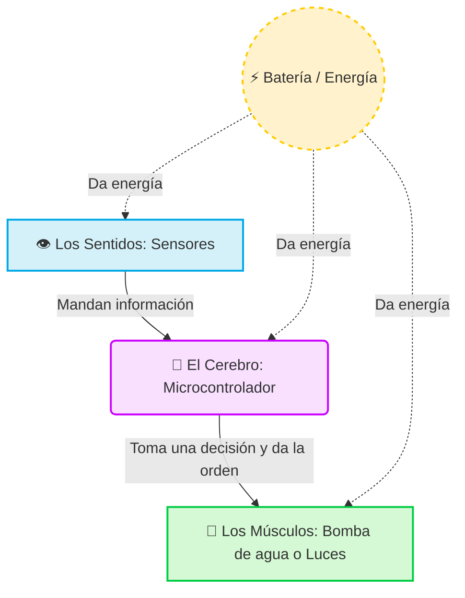

# ⚡ Guía de Electrónica Básica (¡Explicado para Principiantes y Niños!)

> [!info] 🎯 Objetivo de esta guía
> Este documento sirve como introducción amigable a la electrónica necesaria para construir nuestro proyecto **Agritech**. Está diseñado para que cualquier persona pueda entender cómo funciona la "magia" detrás del sistema.

## 🤖 El Cuerpo de nuestro Proyecto

Imagina que nuestro proyecto agrícola es como un pequeño **robot o una plantita electrónica inteligente**. Al igual que nosotros, los humanos, necesita **sentidos** para saber qué pasa a su alrededor, un **cerebro** para pensar, **músculos** para actuar, y **energía** (comida) para vivir.

Vamos a dividir las partes electrónicas en 5 grupos súper sencillos:

### 🧠 1. El Cerebro: El Microcontrolador (Ej. Arduino o ESP32)
Es el jefe del proyecto. Es una pequeña computadora en una placa verde. No tiene músculos ni ojos, pero es muy inteligente. Él es quien recibe las señales de los sentidos, piensa, y da una orden a los músculos.
* **Ejemplo de su trabajo:** _"Mmm, el sensor me dice que la tierra está muy seca... ¡Le diré a la bomba de agua que se encienda!"_

### 👁️ 2. Los Sentidos: Los Sensores
Son los ojos, la nariz y la piel de nuestro proyecto. Solo sirven para **escuchar o sentir el mundo real**.
* **Sensor de Humedad:** Siente si la tierra está mojada o seca.
* **Sensor de Luz:** Ve si hace sol o si ya es de noche.
* **Sensor de Temperatura:** Siente si hace frío o calor.

### 💪 3. Los Músculos: Los Actuadores
Son las partes que *hacen* cosas físicas en el mundo real, obedeciendo las órdenes del cerebro.
* **Bomba de agua:** Es como un corazón que empuja el agua hacia las plantas para regarlas.
* **Ventiladores o Motores:** Para mover el aire o piezas físicas.
* **Luces LED:** Sirven para comunicarnos cosas (como si el robot nos guiñara un ojo para decir "¡Todo está bien!").

### ⚡ 4. La Comida: La Energía 
Ningún robot funciona sin comer. **La electricidad es la comida de nuestro sistema.** Puede venir de una batería, un enchufe de la pared, o de Paneles Solares (comida hecha con el sol).

### 🧵 5. Las Venas: Los Cables y la Protoboard
Los cables son los caminos por donde viaja la electricidad y la información (como nuestras venas). La **Protoboard** (Placa de pruebas) es como una base de Lego gigante con agujeritos, donde conectamos los cables fácilmente sin necesidad de usar pegamento o soldadura.

---

## 📊 Tabla Resumen de Componentes

| Pieza Electrónica | ¿Qué es en la vida real? | Símbolo | Ejemplo en el Proyecto Agritech |
| :--- | :--- | :---: | :--- |
| **Microcontrolador** | El Cerebro | 🧠 | Placa ESP32 o Arduino |
| **Sensor de Humedad**| El sentido del tacto | 🖐️ | Palo clavado en la tierra que avisa si hay sed |
| **Bomba de Agua** | Los Músculos | 💧 | Motorcito que riega la planta automáticamente |
| **Batería/Pila** | La Comida / Corazón | 🍔 | Pila, Powerbank o panel solar |
| **Cables** | Las Venas | 🩸 | Cables de colores que unen todas las piezas |

---

## 🗺️ Mapa Visual: ¿Cómo se comunican las partes?

Aquí tienes un gráfico muy fácil de entender de cómo viaja la información dentro del proyecto:

---

## 🛠️ ¿Cómo funciona la electricidad? (El truco del agua)

Para que el cerebro y los músculos funcionen, la electricidad debe fluir. Imagina que la electricidad es **agua** viajando por unas tuberías:

1. **La Pila (Batería):** Es como un tanque de agua gigante en lo alto de una montaña. Está lleno de energía lista para caer.
2. **El Cable:** Es la tubería por donde baja el agua.
3. **El Interruptor:** Es un grifo. Si lo cierras, el agua (electricidad) no pasa. Si lo abres, el agua fluye.
4. **El LED o Motor:** Es como un pequeño molino de agua. Cuando el agua pasa por él, lo hace girar o brillar.
5. **El Regreso al tanque:** El agua tiene que volver al principio para no derramarse. ¡Por eso los cables siempre hacen un camino de ida y otro de vuelta!

> [!warning] La Regla de Oro del Círculo 🌟
> ¡El circuito (camino de los cables) **siempre tiene que ser un círculo cerrado**! Si el cable se desconecta o se rompe en cualquier parte, el "agua" se detiene por completo y nada funciona.

---

## 🗺️ Leer Diagramas Electrónicos (El Mapa del Tesoro)

Cuando compramos un set de Lego, viene con un librito de instrucciones. En electrónica, ese librito es un **Diagrama Esquemático**. A primera vista parece un montón de líneas y garabatos, pero en realidad es como un mapa del tesoro muy simple.

Cada componente tiene su propio "dibujo" (símbolo) y las líneas rectas que los unen son los **cables**.

### 🧩 1. Símbolos Básicos (El Abecedario Electrónico)

Aquí tienes cómo se dibujan las cosas más comunes:

* 🔋 **Pila / Batería:** Se dibuja como dos líneas paralelas, una más larga que la otra. La línea larga es el lado positivo (+) y la corta el negativo (-).
* ➖ **Cable:** Una línea recta simple que conecta cosas.
* 〰️ **Resistencia (Resistor):** Se dibuja como una línea en zigzag (como el lomo de un cocodrilo o una pequeña sierra).
* 💡 **LED (Luz):** Es un triángulo con una rayita y dos flechas pequeñas apuntando hacia afuera (¡que significan que está tirando luz!).
* 🔘 **Interruptor (Botón):** Se dibuja como una línea que se ha cortado y levantado un puente, como si fuera una puerta abierta.
* 🔌 **Tierra (GND):** Tres rayitas horizontales cada vez más pequeñas hacia abajo. Significa "a dónde va a descansar la electricidad", o el regreso a la pila.

### 🛡️ 2. ¿Qué es una Resistencia? (El Guardia de Tráfico)

Imagina que la electricidad es una manada de mil perritos corriendo súper rápido por un pasillo (cable) para llegar a comer (el LED). 
Si llegan todos de golpe al plato de comida (LED), lo van a romper por comer muy rápido. 
La **Resistencia** es como una pequeña puerta estrecha en el pasillo que hace que los perritos tengan que pasar de uno en uno o más despacio. 

**En resumen:** Frena un poco la electricidad para que no se quemen los componentes delicados.

### 🔋 3. ¿Qué es un Condensador / Capacitor? (El Tanque de Agua)

Se dibuja como dos líneas paralelas del mismo tamaño separadas por un espacio (`||`). 
Es como un pequeño vasito de agua en medio de las tuberías. Se llena de energía poco a poco y, si de repente la bomba de agua principal parpadea o se corta un segundo, el vasito puede vaciarse soltando un chorrito por un ratito. Sirve para que la energía sea muy suave y estable, evitando que el sistema se reinicie por falta de energía.

### 🔎 ¿Cómo leer un circuito paso a paso?

Para entender un diagrama sin perderte, siempre sigue este "truco de explorador":

1. **Busca la fuente (+):** Encuentra la Batería (o el signo VCC / 5V / 3.3V). Ese es el origen de la cascada de agua (o de tu aventura).
2. **Sigue la línea:** Pon tu dedo en el papel o pantalla y sigue la línea recta (el cable) como si caminaras por un sendero.
3. **Mira los obstáculos:** Si tu dedo pasa por un zigzag, ¡cuidado!, la energía va más lento (Resistencia). Si pasa por un interruptor abierto, ¡tu dedo no puede saltar!, significa que ahí la energía se corta.
4. **Encuentra la Tierra (- o GND):** Toda cascada tiene que terminar en un lago. El lago es el símbolo GND (Ground / Tierra). Si tu dedo llega ahí siguiendo la línea de manera ininterrumpida, ¡el circuito funciona y se completó con éxito!

---

## 🎥 Videos Recomendados (Para ver y aprender)

Para terminar de entender esta magia, te recomiendo ver estos videos cortos:

1. **[¿Qué es la Electricidad? (Explicación Animada)](https://www.youtube.com/watch?v=dzcG5a5kdEY)** - Entiende cómo viaja la energía de forma divertida.
2. **[¿Qué es Arduino y cómo funciona?](https://www.youtube.com/watch?v=nL34zDTPkcs)** - Entendiendo al "Cerebro" de nuestros proyectos.
3. **[Cómo usar una Protoboard (Lego electrónico)](https://www.youtube.com/watch?v=PEgXW2H-q-Q)** - Para saber dónde enchufar los cables sin equivocarse.