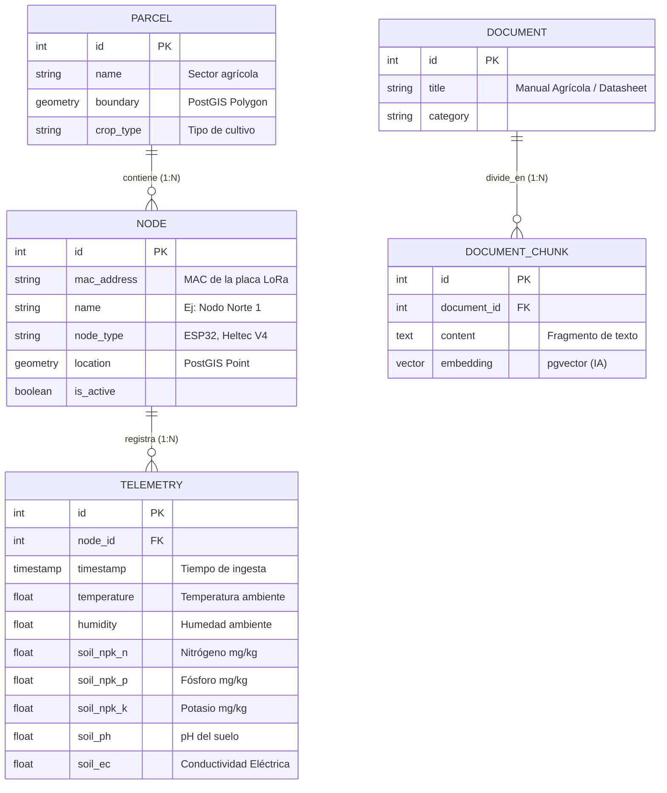
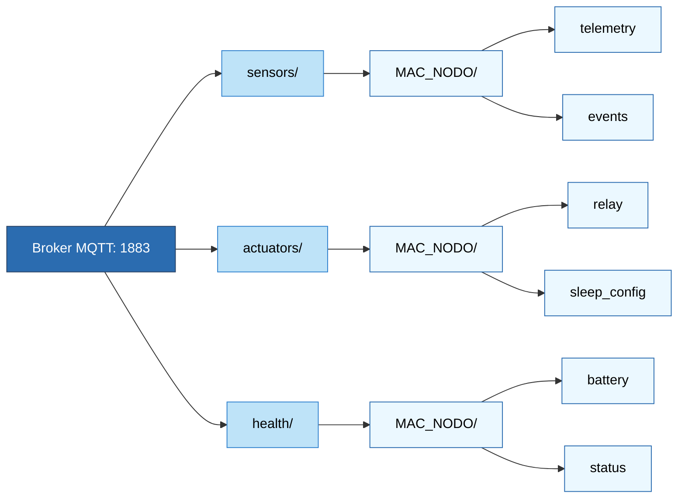

---
tags:
  - backend
  - podman
  - fastapi
  - microservicios
aliases:
  - Backend
  - API Core
---
# Arquitectura de Backend (Core Lógico)

El software del Hub Central se orquesta utilizando **Podman** (licencia Apache 2.0), una tecnología daemonless que aísla cada proceso, mejora la seguridad y asegura la distribución comercial libre de regalías. Se estratifica en capas conectadas por redes virtuales.

## Los 6 Microservicios Contenedorizados

### Capa 1: Comunicación e Ingesta
1. **Contenedor 1 - Eclipse Mosquitto (Broker MQTT):** Recibe las tramas JSON publicadas por los servicios locales.
2. **Gateway Serial Listener (`lora_serial_listener.py`):** Script Python (`pyserial`) en el host que lee directamente por USB (puerto COM/tty) del Heltec receptor las tramas crudas P2P (RadioLib) y las inyecta como JSON a Mosquitto.
3. **Contenedor 2 - Worker Ingesta (`mqtt_ingest.py`):** Demonio de fondo (Background Worker). Escucha Mosquitto, normaliza datos y realiza escrituras hacia la BD (PostgreSQL).
3. **Contenedor 3 - Worker Multimedia (Bash/Python):** Capturador RTSP que extrae periódicamente fotogramas clave (keyframes) de las cámaras IP (ESP32-CAM) y los guarda en el FS local.

### Capa 2: Persistencia Multimodal (Data & GIS)
4. **Contenedor 4 - PostgreSQL (Motor Principal):** Con *Write-Ahead Logging (WAL)* obligatorio para evitar corrupción por apagones. 
   - *Big Data (Series Temporales):* Particionamiento declarativo por mes.
   - *PostGIS:* Aislado vía TCP/IP, guarda polígonos y coordenadas.
   - *pgvector:* Almacén de embeddings para indexar manuales agrícolas.

### Capa 3: Lógica de Negocio y Core API
5. **Contenedor 5 - FastAPI Central (Core):** Expone información y orquesta reglas.
   - *Motor Determinista:* Reglas If-Then-Else para control de riego ("Activar relé si humedad < 30%").
   - *RBAC:* Seguridad JWT diferenciando Operario vs Agrónomo.
   - *Geo-REST API:* Traduce telemetría a GeoJSON.
   - *AI Stubs (Function Calling):* Funciones envolventes de actuadores para futuras IA.

### Capa 4: Presentación
6. **Contenedor 6 - NGINX (Servidor Web):** Sirve archivos estáticos de la PWA offline (Vue) e imágenes fotográficas guardadas por el Worker Multimedia.

👉 **Visualiza estas conexiones en:** [[Infraestructura_y_Graficos]]

---

## Estructura de Proyecto Sugerida (Clean Architecture)
El código de FastAPI se estructurará siguiendo principios de *Clean Architecture*:

```text
hub_agritech_core/
├── app/
│   ├── api/          # Controladores y rutas (v1/telemetry.py, spatial.py)
│   ├── core/         # Configuración, seguridad (JWT), settings
│   ├── db/           # Modelos SQLAlchemy, PostGIS y migraciones (Alembic)
│   ├── services/     # Lógica de negocio pesada, algoritmos
│   ├── workers/      # Procesos en segundo plano (Ingesta MQTT, RTSP)
│   └── main.py       # Punto de entrada de FastAPI
├── scripts/          # Utilidades (backups, restauraciones)
├── Dockerfile        
├── docker-compose.yml 
└── requirements.txt  
```

---

## Modelado de Datos: Diagrama Entidad-Relación (ERD)

El siguiente esquema ilustra la relación en la base de datos PostgreSQL usando SQLAlchemy, mostrando cómo se integran las extensiones espaciales (PostGIS) y vectoriales (pgvector).



---

## Topología de Tópicos MQTT (Ingesta)

El Worker MQTT y los dispositivos LoRa se comunican a través del broker utilizando el siguiente árbol jerárquico de tópicos:


