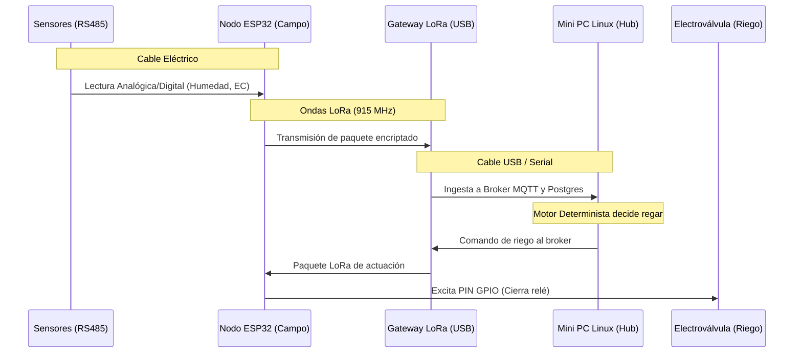

---
tags:
  - hardware
  - iot
  - lora
  - esp32
aliases:
  - Capa Física
  - Sensores
---
# Arquitectura de Hardware Físico

El diseño de hardware responde a las exigencias duras del entorno agroindustrial. En lugar de centralizar todo mediante cables largos propensos a caídas de tensión y ruido electromagnético, se implementa una **topología distribuida y descentralizada**.

## 1. Cerebro Hub (Caseta Central)
Se ubica en un lugar protegido con suministro eléctrico estable.
- **Servidor Central (Mini PC Linux):** Equipo industrial (Intel N100 o AMD Ryzen SFF). Aloja los contenedores, base de datos local y futuros módulos IA. Consumo ultra bajo (6W - 15W).
- **Nodo Concentrador (Gateway LoRa):** Un ESP32 configurado como receptor maestro, conectado directamente por cable USB al Mini PC. Escucha el aire, captura paquetes LoRa y los entrega por puerto serial (tty).
- **Conectividad Externa:** Router 3G/4G básico que dota al Hub de una salida mínima a internet (sólo notificaciones Push/WhatsApp).

👉 **Conoce el software de este servidor en:** [[Arquitectura_Backend]]

## 2. Entorno de Campo (Nodos Distribuidos IoT)
Equipos hiper-económicos y de muy bajo consumo distribuidos por las hectáreas.
- **Microcontrolador Base:** Familia ESP32 / Arduino. Funcionan con energía solar (panel + batería LiFePO4).
- **Sensórica Industrial:** Sondas NPK, humedad de suelo, y conductividad eléctrica (CE) cableadas al ESP32 usando protocolos robustos como **RS485 (Modbus-RTU)** o **SDI-12**.
- **Actuadores:** Módulos de relés de estado sólido optoacoplados para abrir/cerrar electroválvulas de agua.
- **Nodos de Visión:** Cámaras IP independientes que transmiten vía Wi-Fi direccional al hub central.

## 3. Capa de Comunicación Inalámbrica (Sin Internet)
- **Red LoRa (Larga Distancia):** Módulos RF (915 MHz en LATAM, 868 MHz en Europa). Envían datos a kilómetros de distancia con bajo consumo.
- **Bluetooth (Emergencia):** Integrado en nodos ESP32 para lectura directa del operario mediante smartphone en el campo.

---

## Diagrama de Flujo Lógico y Físico

