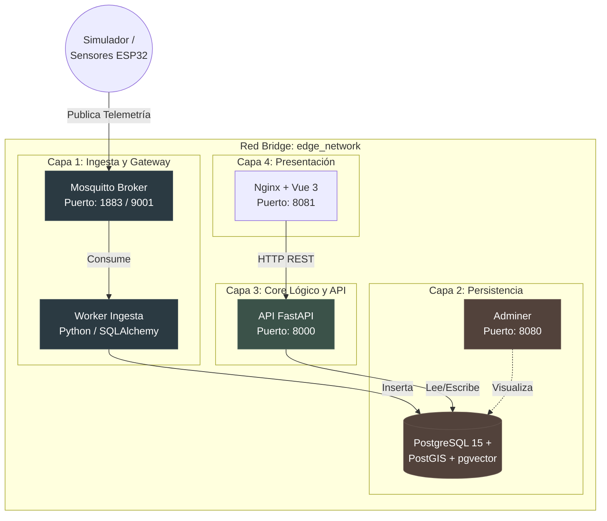
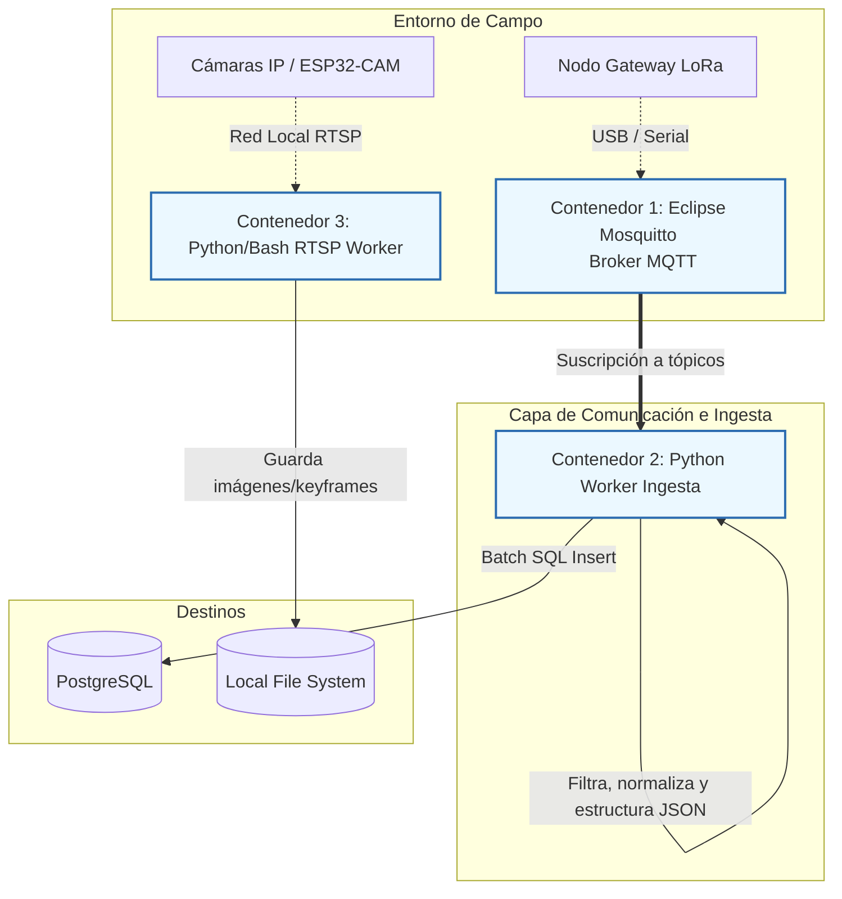
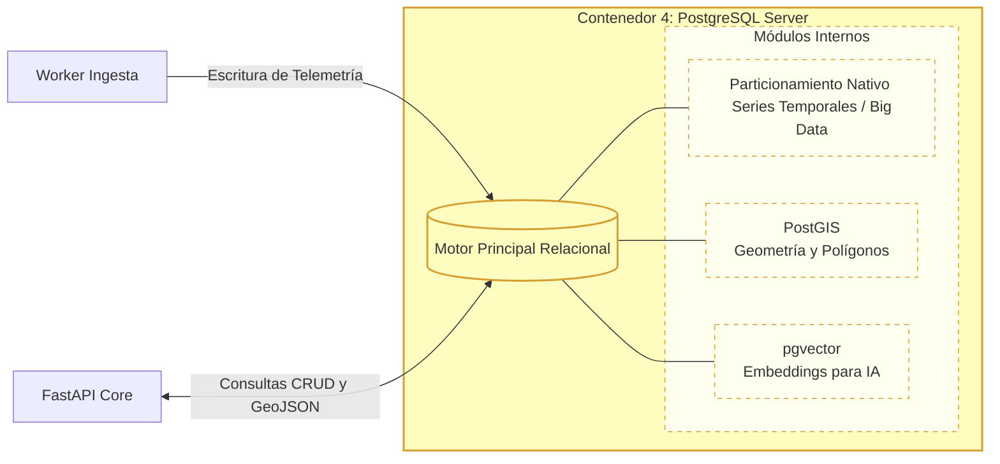
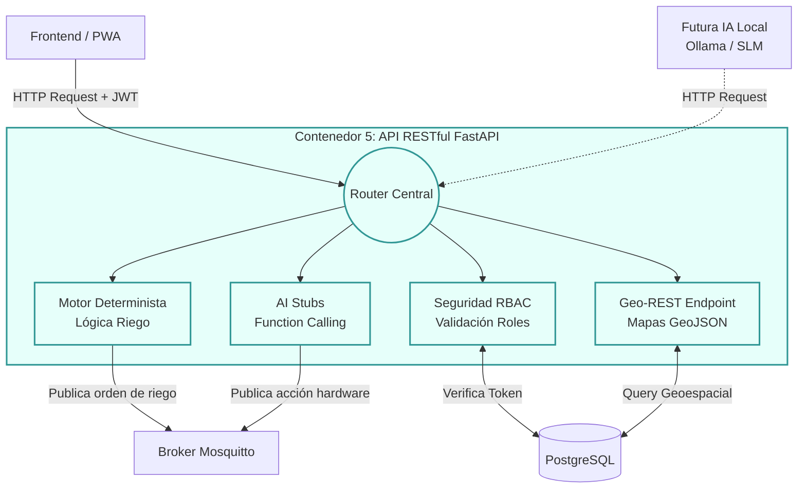
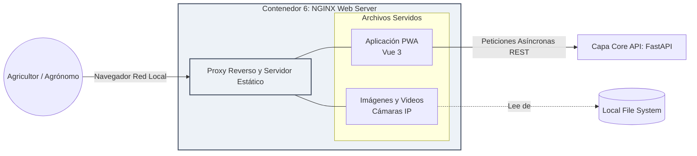

# Infraestructura y Gráficos

El siguiente diagrama detalla la orquestación general actual de microservicios usando Docker Compose:

---

## Desglose por Capas

### 2.1 Capa de Comunicación e Ingesta (Edge Gateway)

Este diagrama ilustra cómo los datos crudos del campo entran al Hub, se filtran y se preparan para su almacenamiento.

---

### 2.2 Capa de Persistencia Multimodal (Data & GIS)

Este esquema detalla la estructura interna del contenedor de base de datos y cómo sus diferentes extensiones gestionan la naturaleza multimodal de la información.

---

### 2.3 Capa de Lógica de Negocio y Core API

Aquí se visualiza el "cerebro" del sistema, donde conviven la seguridad, las reglas clásicas y las interfaces preparadas para la Inteligencia Artificial.

---

### 2.4 Capa de Presentación (Frontend)

Este diagrama muestra cómo el agricultor o agrónomo consume la información procesada sin necesidad de conectarse a internet, utilizando la red local de la finca.

---

## PDFs Gráficos Originales
En tu estructura de directorios antigua existen estos archivos que documentan a nivel de hardware, arquitectura física, y conectividad IoT. Puedes utilizarlos como referencia anexa en el Obsidian:
- `Arquitectura_Hardware_Fisico_Hub.pdf`
- `Arquitectura_Hub_Edge_AI_Agricola.pdf`
- `Arquitectura_Software_Microservicios_Hub.pdf`
- Documentos PDF dentro de la carpeta `Capas`.
