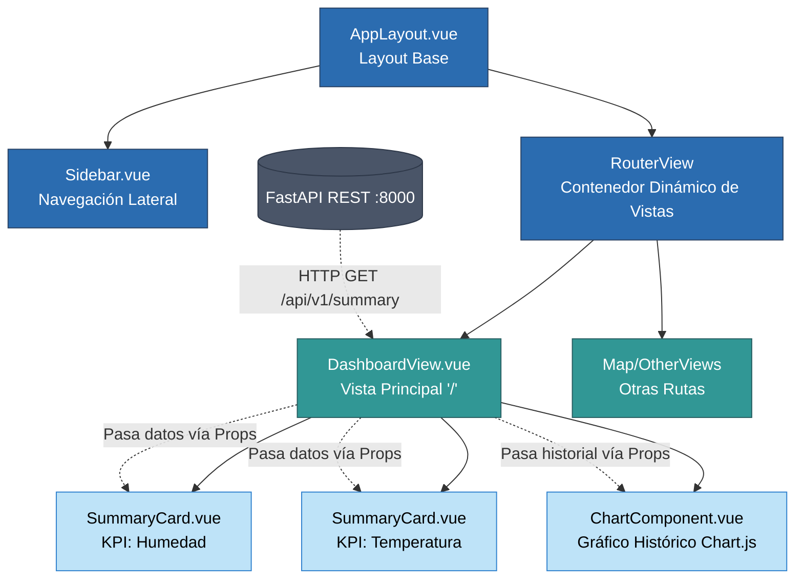

# Integración Frontend

*Nota: El frontend está construido con herramientas y frameworks existentes (Vue 3). Esta sección documenta su conexión, empaquetado y uso en lugar del desarrollo interno.*

## Stack y Decisiones
- **Framework:** Vue 3 (Composition API) + Vite.
- **Estilos:** Vanilla CSS basado en variables globales, flexbox y CSS Grid. No se utiliza Tailwind.
- **Componentes actuales:** `AppLayout.vue`, `Sidebar.vue`, `SummaryCard.vue`, `DashboardView.vue` (ruta principal `/`).

## Contenerización (Docker)
El frontend se compila usando un `Dockerfile` en el directorio `./frontend`.
1. **Fase de Build:** Ejecuta `npm install` y `npm run build` para compilar Vue 3.
2. **Fase de Producción:** Usa una imagen `nginx:alpine` copiando los estáticos a `/usr/share/nginx/html`.

En el `docker-compose.yml`, el servicio se levanta como `hub_frontend_nginx`.

## Conexiones y Puertos
- Expuesto localmente en el puerto **8081** (Se eligió para evitar errores *rootless ports* menores a 1024 en Podman).
- El frontend se comunica con el servicio de backend `hub_fastapi` para consumir los datos vía HTTP/REST.

## Uso en desarrollo
Cualquier cambio a las llamadas a la API debe considerar que FastAPI está expuesto en el puerto 8000. Si se desarrolla en modo *hot-reload* (fuera de Docker), el entorno Vite debe configurar proxies hacia `localhost:8000`.

---

## Diagrama de Jerarquía de Componentes Vue 3

El frontend sigue una arquitectura basada en Composition API. El siguiente diagrama muestra la estructura de componentes principal y el flujo de datos unidireccional (props):

