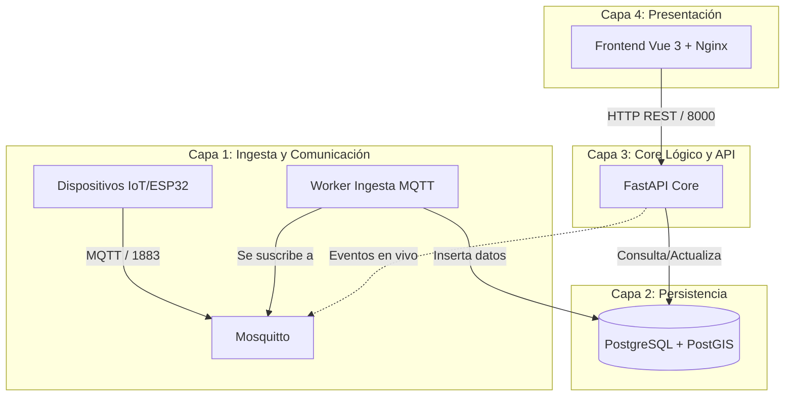

# Documentación del Sistema: Hub Edge AI Agrícola

## 1. Visión General
El proyecto **Hub Edge AI Agrícola** es un sistema distribuido diseñado para la ingesta, almacenamiento, procesamiento y visualización de telemetría proveniente de dispositivos IoT (como ESP32) en entornos agrícolas. 

> [!info] Estado Actual del Proyecto
> Actualmente, el proyecto se encuentra en una etapa inicial (esqueleto/arquitectura base), definiendo los servicios principales orquestados mediante Docker Compose.

## 2. Arquitectura del Sistema
El sistema se compone de cuatro capas principales que interactúan entre sí dentro de una red aislada de Docker (`hub_edge_network`).

## 3. Relaciones e Interacciones

### Capa 1: Ingesta y Comunicación (Gateway)
- **Mosquitto (MQTT Broker)**: Actúa como el punto de entrada para los mensajes de los sensores IoT. Expone el puerto `1883` para comunicación estándar MQTT y `9001` para WebSockets.
- **Worker de Ingesta (`app/workers/mqtt_ingest.py`)**: Un demonio en Python diseñado para escuchar de forma continua los tópicos de Mosquitto. Su propósito es transformar y validar los payloads entrantes para luego insertarlos en la base de datos PostgreSQL.

### Capa 2: Persistencia (Big Data, GIS & IA)
- **PostgreSQL con PostGIS y pgvector**: Base de datos relacional con extensiones espaciales (PostGIS) preparadas para datos geolocalizados del entorno agrícola y pgvector para almacenamiento vectorial (IA). Se orquesta a través de una imagen Docker personalizada (`db/Dockerfile`). Es la fuente de verdad del sistema.
- **Adminer**: Herramienta de administración de base de datos expuesta en el puerto `8080` para revisión y mantenimiento local.

### Capa 3: Core Lógico y API
- **API REST (`app/main.py`)**: Construida con FastAPI. Expone endpoints en el puerto `8000` para ser consumidos por el Frontend u otros servicios.
  - **Relaciones**: Se conecta a la base de datos PostgreSQL a través de SQLAlchemy/GeoAlchemy2 para operaciones de lectura/escritura de la telemetría y datos geoespaciales.
  - **Interacciones**: En el futuro, podría suscribirse o publicar en Mosquitto para comunicación bidireccional con los sensores.

### Capa 4: Presentación (Frontend)
- **Vue 3 + Vite**: Aplicación Single Page Application (SPA) desarrollada en Vue 3. 
  - **Esqueleto Visual**: Se ha implementado un diseño moderno y modular (estilo Dashboard SaaS premium) usando CSS Vanilla y variables globales preparadas para personalización corporativa futura.
  - **Componentes Base**: Incluye un layout principal (`AppLayout`, `Sidebar`) y vistas como `DashboardView` que organizan el resumen del sistema mediante tarjetas interactivas (`SummaryCard`).
  - Se orquesta en Docker mediante un "multi-stage build" pero se ha configurado el puerto `8081` de cara al anfitrión (ajuste realizado para compatibilidad con Podman Rootless).
  - **Interacciones**: Consume los datos de la API (Capa 3) vía peticiones HTTP para mostrar al usuario métricas, mapas, etc. Su rol es exclusivamente presentar la información consolidada por el Core API.

## 4. Estado Actual del Proyecto

### Backend (`app/`)
- `app/main.py`: Punto de entrada de FastAPI. Tiene integrado el enrutador v1 y CORS configurado.
- `app/db/database.py`: Contiene la configuración del engine de base de datos y la sesión utilizando SQLAlchemy.
- `app/api/v1/endpoints.py`: Posee el endpoint de comprobación base (Healthcheck).
- `app/workers/mqtt_ingest.py`: Bucle de ejecución preparado para la ingesta de telemetría, dependiente de `paho-mqtt`.

### Frontend (`frontend/`)
- `src/assets/main.css`: Sistema de diseño base con variables CSS (listo para la customización del Admin).
- `src/components/layout/`: Contiene `AppLayout.vue` y `Sidebar.vue` para la estructura de la aplicación.
- `src/components/dashboard/`: Contiene `SummaryCard.vue` para las tarjetas de métricas clickeables.
- `src/views/DashboardView.vue`: Layout de cuadrícula principal con métricas iniciales y acceso a la vista del mapa.
- `src/router/index.ts`: Orquesta las rutas de navegación del frontend.

### Infraestructura
- El proyecto usa Docker Compose (`docker-compose.yml`) con declaración de volúmenes persistentes y red compartida (`edge_network`). Se incluye una imagen personalizada en `db/Dockerfile` para la BD avanzada.
