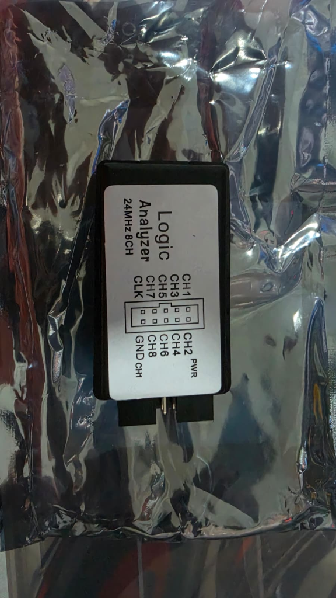
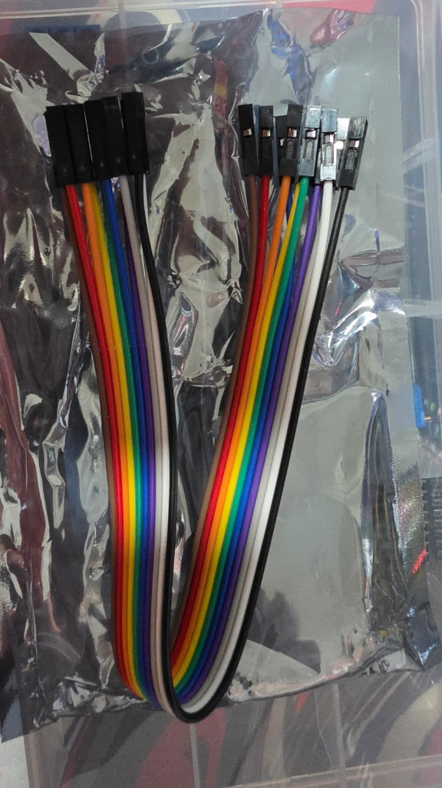

---
tags:
  - hardware
  - herramienta
  - debug
  - analizador-logico
fabricante: "Genérico (Clon Saleae)"
estado: "adquirido"
---
# Analizador Lógico USB 24MHz 8 Canales

## 1. Descripción General y Uso
El **Analizador Lógico USB (8 Canales, 24MHz)** es una herramienta de diagnóstico y depuración imprescindible para proyectos de hardware y electrónica como el **Hub Agritech Core**. Funciona "escuchando" las señales digitales (1s y 0s) que viajan por los cables entre microcontroladores y sensores, permitiéndote verlas gráficamente en la pantalla de tu computadora.

Es la herramienta perfecta para diagnosticar problemas de comunicación en protocolos como **I2C, SPI, UART o RS485**. Si el ESP32 no logra leer el sensor de color (I2C) o el sensor de suelo (RS485), conectar este analizador a los cables de datos te mostrará exactamente qué está enviando cada dispositivo, permitiéndote saber si es un fallo de hardware, de cableado o de código.

## 2. Datos Técnicos
- **Frecuencia de Muestreo Máxima:** 24 MHz (24 Millones de muestras por segundo). Suficiente para leer I2C (hasta 1MHz), UART estándar y SPI básico.
- **Canales de Entrada:** 8 canales simultáneos (CH1 a CH8).
- **Nivel Lógico Compatible:** 3.3V y 5V (Perfecto para el ecosistema ESP32 y Arduino). No conectar a voltajes industriales directos como 12V o 24V sin un divisor de voltaje.
- **Conexión al PC:** USB Type-C (o Mini-USB según la variante).
- **Software Recomendado:** Es compatible con el excelente software **Saleae Logic** (versión 1.2.18 o superior) o el software de código abierto **PulseView / sigrok**.

## 3. Guía de Conexión y Organización de Cables
El dispositivo cuenta con un puerto de 10 pines (2 filas de 5). El kit incluye un cable plano (ribbon) de 10 hilos con conectores Dupont hembra individuales en ambos extremos. 

Dado que los extremos están separados, **tú eliges qué color va a qué pin**, pero para evitar un caos de cables al momento de depurar, **te sugiero adoptar la siguiente convención estándar** basada en el orden natural de los colores de la cinta:

### Mapeo de Pines (Vista frontal al conector)

| Pin Superior | Sugerencia de Color | | Pin Inferior | Sugerencia de Color |
| :---: | :---: | :---: | :---: | :---: |
| **CLK** | Blanco | | **GND** | **Negro** (Vital) |
| **CH7** | Gris | | **CH8** | Morado |
| **CH5** | Azul | | **CH6** | Verde |
| **CH3** | Amarillo | | **CH4** | Naranja |
| **CH1** | Rojo | | **CH2** | Marrón |

> [!IMPORTANT] La regla de oro del Analizador Lógico
> **SIEMPRE conecta el pin GND (Negro)** del analizador lógico a la tierra (GND) del circuito que estás midiendo. Si no comparten la misma tierra, las lecturas serán ruido puro y no verás ninguna señal útil.

### Ejemplo de Uso Práctico (Depurar I2C)
Si el sensor de color GY-33 no responde:
1. Conecta el **Negro (GND)** al GND del ESP32.
2. Conecta el **Rojo (CH1)** al cable **SDA** (Datos).
3. Conecta el **Marrón (CH2)** al cable **SCL** (Reloj).
4. Abre el software en tu PC, configura el analizador para protocolo I2C en CH1 y CH2, y dale a grabar. ¡Verás los bits volando en la pantalla!
