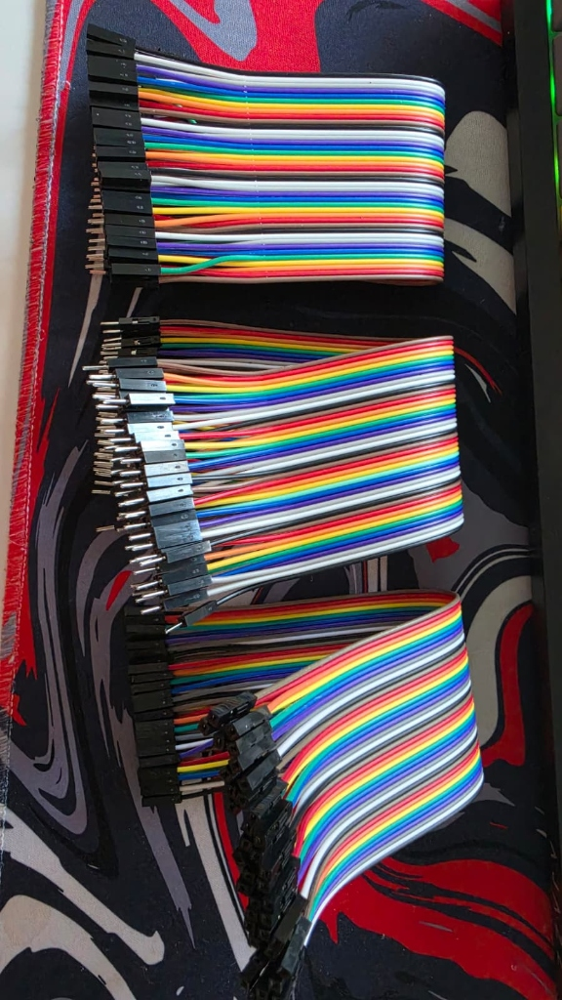

---
tags:
  - hardware
  - cables
  - dupont
  - prototipado
---

# Cables Jumper Dupont (Macho-Macho, Macho-Hembra, Hembra-Hembra)

## 1. Descripción General
Conjunto de cables de puente (jumpers) estilo Dupont, esenciales para el prototipado de circuitos electrónicos. El paquete incluye 120 pines divididos en tres tipos (Macho-Macho, Macho-Hembra, Hembra-Hembra) con una longitud de 20 cm cada uno. Son utilizados para conectar componentes, sensores y placas de desarrollo (como el Heltec V4) en protoboards sin necesidad de soldar.

## 2. Especificaciones Técnicas
- **Longitud:** 20 cm
- **Cantidad:** 120 pines en total (generalmente divididos en 3 cintas de 40 cables)
- **Tipos de conexión (3 kinds):**
  - Macho a Macho (M-M): Para conectar de protoboard a protoboard o placa.
  - Macho a Hembra (M-H): Para conectar pines macho de una placa (ej. pines del Heltec) a una protoboard.
  - Hembra a Hembra (H-H): Para conectar entre placas o módulos con pines macho directamente.
- **Calibre del cable:** Generalmente AWG 28 o AWG 24
- **Espaciado de conectores:** 2.54 mm (0.1"), estándar para protoboards y pines de placas Arduino/ESP32.

## 3. Guía de Uso de Colores (Convención Estándar)
Aunque eléctricamente todos los cables son idénticos por dentro, usar un código de colores facilita enormemente el diagnóstico y mantenimiento de los circuitos. 

A continuación, se recomienda una tabla de uso basada en convenciones estándar de electrónica:

| Color del Cable | Uso Recomendado / Convención Común | Notas |
| :--- | :--- | :--- |
| **Rojo** | **Voltaje / VCC** (Ej: 3.3V, 5V, VIN) | *Nunca* lo uses para otra cosa para evitar cortocircuitos accidentales. |
| **Negro** | **Tierra / GND** | Al igual que el rojo, reserva este color estrictamente para tierra. |
| **Marrón** | Tierra alternativa / GND secundaria | En cables de servos, el marrón suele ser GND. |
| **Amarillo** | Señales de datos (SDA), TX, o PWM | Muy usado para I2C (SDA) o líneas seriales de transmisión. |
| **Naranja** | Señales de reloj (SCL), RX, o 3.3V (ATX) | En I2C suele usarse para SCL. En servos es la señal PWM. |
| **Verde (Turquesa)** | Señales Analógicas, MISO, o RX | Buen color para lectura de sensores o líneas de recepción. |
| **Azul** | Señales Analógicas, MOSI, o TX | Común en buses SPI y sensores. |
| **Morado** | Señales misceláneas, Chip Select (CS) | Ideal para pines de control, Enable (EN) o interrupciones. |
| **Gris** | Señales secundarias, Bus de datos | Apto para conexiones auxiliares. |
| **Blanco** | Señal / Datos auxiliares | En algunos conectores y tiras LED, el blanco es la señal de datos. |

> [!TIP] Buenas Prácticas
> Al armar tu prototipo Hub Agritech (por ejemplo, al conectar el módulo CP2102 al Heltec V4):
> - Usa siempre **Rojo** para 3.3V/5V.
> - Usa siempre **Negro** (o en su defecto marrón) para GND.
> - Usa **Azul/Verde/Amarillo/Naranja** cruzados para TX y RX, asegurándote de documentar qué color es cuál.

## 4. Referencias y Documentación
*No hay hojas de datos específicas para estos cables genéricos, pero la convención de colores proviene de las normativas de resistencia (EIA) y fuentes de poder ATX.*
