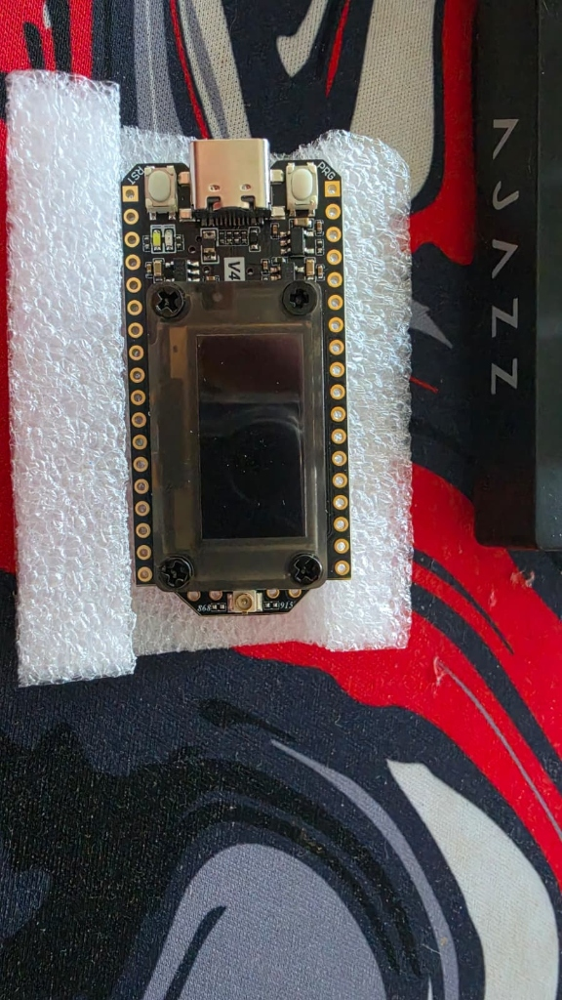
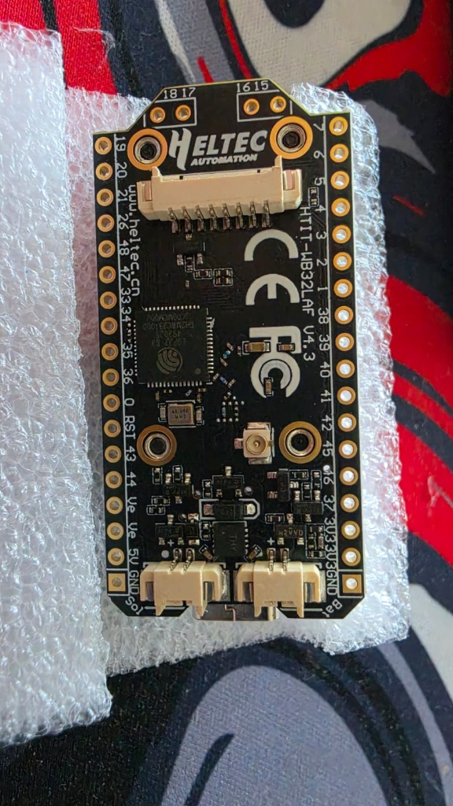
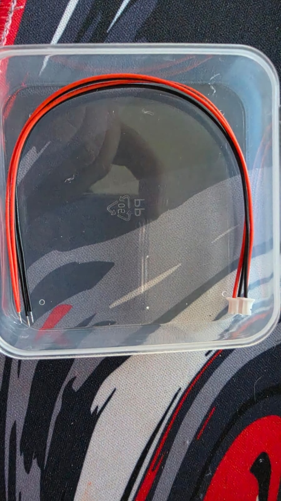
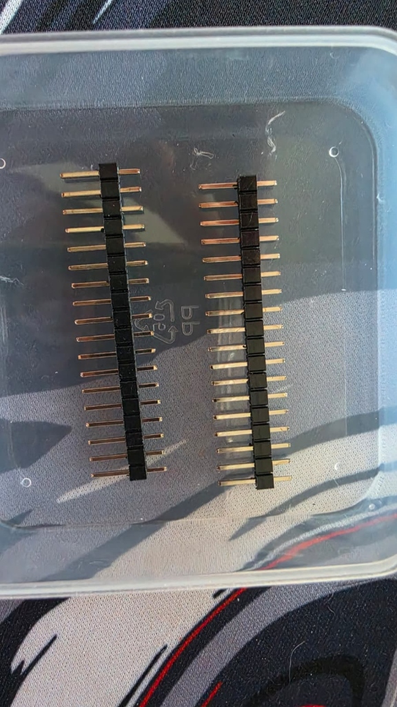
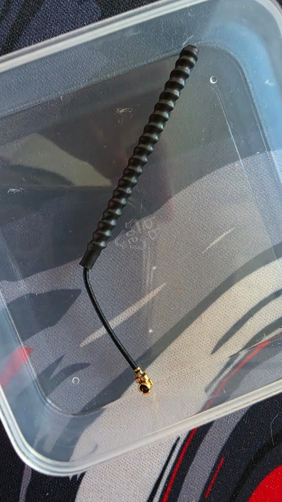

---
tags:
  - componente
  - ficha-tecnica
  - lora
  - gateway
  - esp32
fabricante: "Heltec Automation"
estado: "por investigar"
---
# Heltec V4 LoRa32 ESP32-S3 SX1262 (868MHz) OLED

## 1. Descripción General y Uso
La placa **Heltec WiFi LoRa 32 V4** es una poderosa placa de desarrollo IoT que integra Wi-Fi, Bluetooth 5.0 (BLE) y comunicación LoRa de largo alcance en un solo módulo. 

En el contexto de **Hub Agritech Core**, esta placa es considerada la joya de la corona para la arquitectura física, ya que puede actuar en dos frentes clave:
1. **Nodo de Campo Avanzado:** Su conector de batería integrado y optimización de energía lo hacen perfecto para recolectar datos de sensores en medio del cultivo usando energía solar.
2. **Gateway LoRa a USB:** Puede conectarse directamente por USB al Mini PC del Hub Central y hacer de "Nodo Concentrador" o Gateway, traduciendo los paquetes LoRa que vienen del aire hacia comandos seriales (UART) que el *Worker Ingesta* en Python puede entender. Su pequeña pantalla OLED es sumamente útil para mostrar logs de paquetes recibidos en tiempo real sin necesidad de monitor.

## 2. Datos Técnicos (Datasheet)
- **Microcontrolador (MCU):** ESP32-S3R2 (Dual-core, Wi-Fi, BLE 5.0).
- **Transceptor LoRa:** Semtech **SX1262** (Mucho más eficiente y con mayor rango que el clásico SX1276). Soporta potencias de transmisión de 28±1 dBm.
- **Frecuencia:** 868MHz (Ideal para el marco regulatorio europeo y ciertos países de LATAM).
- **Pantalla Integrada:** OLED de 0.96 pulgadas (Controlador SSD1315).
- **Memoria:** 16MB Flash externa + 2MB PSRAM.
- **Gestión de Energía:** 
  - Consumo en Deep Sleep: Menos de 20μA (Excelente para campo).
  - Incluye conector de batería Li-Po de litio (SH1.25-2P) con circuito de carga y gestión integrado.
- **Voltaje de Lógica (VCC):** 3.3V estrictamente para los pines GPIO. Alimentación general vía USB-C a 5V.

## 3. Guía de Conexión (Pinout) e Integración
A diferencia de un ESP32 clásico, la Heltec V4 tiene periféricos físicos atados a ciertos pines GPIO internos y ofrece una disposición de pines orientada a despliegues autónomos.

### Análisis de Pines Físicos (Reverso de la placa)
Basado en las imágenes del hardware adquirido, la placa presenta la siguiente distribución clave:

**Conectores Inferiores (Energía Autónoma):**
- **Conector JST `Bat`:** Entrada directa para batería Li-Po/Li-Ion de 3.7V. Utilizar el cable rojo/negro incluido respetando la polaridad.
- **Conector JST `Sol`:** Entrada directa para panel solar. Permite recargar la batería autónomamente, vital para los nodos distribuidos en el campo sin cableado eléctrico.

**Conector Antena (Inferior centro):**
- **U.FL / IPEX:** Aquí debe encajarse a presión el cable (Pigtail) de la antena de resorte negro de 868MHz incluida. *¡Nunca transmitir LoRa sin la antena conectada o el chip SX1262 se quemará!*

**Cabezales de Pines (Headers para soldar):**
Se incluyen dos tiras de pines macho que deben soldarse para usar en una protoboard o PCB personalizada. Algunos pines clave de salida son:
- **Pines de Poder:** `5V` (Entrada/Salida según el USB), `3V3` (Salida regulada 3.3V), `GND` (Masa común).
- **Pines Libres (ADC/GPIO):** A la derecha encontramos pines como el `1, 2, 3, 4, 5, 6, 7` que están libres y son ideales para conectar las lecturas analógicas o digitales de los sensores de suelo.
- **Pines Reservados (Evitar usarlos externamente):** 
  - `GPIO 17, 18` -> Dedicados al I2C (_Inter-Integrated Circuit_ o circuito interintegrado) interno de la Pantalla OLED.
  - `GPIO 8 al 14` -> Dedicados a la comunicación SPI(Serial Peripheral Interface) con el chip LoRa.

*(Nota: Para programarla en Arduino IDE, debes descargar el paquete oficial de placas de Heltec para el ESP32).*
![[LORA42 v4 Pin Map.png]]
## 4. Recursos, Guías y Multimedia

- **Documentación Oficial y Pinout Completo:** [Heltec WiFi LoRa 32 V4 Docs](https://docs.heltec.org/en/node/esp32/wifi_lora_32_v4/index.html)
- **Repositorio de Librerías (GitHub):** [Heltec ESP32 Library](https://github.com/Heltec-Aaron-Lee/WiFi_Kit_series)

### Galería de Imágenes (Hardware Adquirido)
*Componentes desglosados listos para soldaje y ensamblaje:*







### Video de Referencia
*Video guía que muestra las capacidades y puesta en marcha de la placa Heltec V3/V4, útil para comprender su ecosistema de programación:*

<iframe width="560" height="315" src="https://www.youtube.com/embed/jZ_y9N55g1o" title="Heltec LoRa32 Guide" frameborder="0" allow="accelerometer; autoplay; clipboard-write; encrypted-media; gyroscope; picture-in-picture" allowfullscreen></iframe>


## Guía de Configuración y Desarrollo (Arduino IDE, PlatformIO y Meshtastic)
A continuación se detalla la guía de preparación y configuración para desarrollar con la placa Heltec WiFi LoRa 32 V4, basada en las recomendaciones de OpenELAB.

### 1. Consideraciones Iniciales de Hardware
* **Antena siempre primero:** Conecta siempre la antena LoRa al conector U.FL antes de energizar la placa. Esto evita dañar el transceptor SX1262.
* **Cable USB adecuado:** Usa un cable USB-C de buena calidad que soporte transferencia de datos. Los cables que solo sirven para carga no permitirán flashear la placa.
* **Drivers CP210x:** Asegúrate de instalar los drivers *CP210x USB-to-UART bridge* en tu sistema para que el equipo reconozca la placa.

### 2. Configuración en Arduino IDE
Para los que prefieren el entorno oficial de Arduino:
1. **Añadir el Gestor de Tarjetas (Boards Manager):** Ve a `Archivo > Preferencias` e ingresa la siguiente URL en "Gestor de URLs Adicionales de Tarjetas":
   `https://resource.heltec.cn/download/package_heltec_esp32_index.json`
2. **Instalar el framework de Heltec:** Ve a `Herramientas > Placa > Gestor de Placas`, busca **"Heltec ESP32"** y descarga el paquete.
3. **Seleccionar Placa:** En la lista de placas, elige **"Heltec WiFi LoRa 32 (V4)"**.
4. **Configuración del puerto serial:** Para poder usar el Monitor Serie a través del puerto USB nativo, asegúrate de habilitar la opción **"USB CDC On Boot"** dentro del menú Herramientas.

### 3. Configuración en PlatformIO
El soporte oficial para la V4 en PlatformIO a veces requiere una pequeña configuración manual inicial:
* **Creación del proyecto:** Crea un proyecto y selecciona provisionalmente una placa similar (como la V3) como base.
* **Definición de la placa:** Para apuntar a la V4, crea una carpeta `boards` en la raíz de tu proyecto y dentro coloca un archivo `heltec_wifi_lora_32_V4.json` con las configuraciones y particiones de memoria de la V4 (ESP32-S3 y 8MB Flash).
* **Build Flags esenciales:** Añade lo siguiente a tu archivo `platformio.ini`:
  ```ini
  -DARDUINO_heltec_wifi_lora_32_V4
  -DARDUINO_USB_MODE=1
  -DARDUINO_USB_CDC_ON_BOOT=1
  ```

### 4. Firmware Recomendado: LoRa Nativo P2P (RadioLib)
Para el proyecto **Hub Agritech Core**, se ha decidido **NO utilizar Meshtastic** y optar por **LoRa Nativo P2P (Estrella)** mediante librerías estándar en C++ como **RadioLib**. 

**¿Por qué no usamos Meshtastic?**
- **Fricción con sensores Custom:** Meshtastic es un firmware de malla P2P cerrado (orientado a mensajería humana) que dificulta enormemente la integración directa de sensores industriales (como sondas RS485 Modbus, ADC, I2C) en el mismo bucle del microcontrolador.
- **Sobrecarga de Protocolo:** Utiliza encriptación AES-256 y serialización Protobuf pesada, lo cual es innecesario para emitir telemetría simple hacia un gateway central.
- **Deep Sleep Ineficiente:** El modo malla requiere que los nodos estén despertando constantemente para rutear paquetes ajenos, drenando las baterías de los nodos solares aislados.

**Arquitectura Implementada:**
1. **Nodos de Campo (ESP32):** Leen los sensores de suelo -> Empaquetan JSON/Binario -> Transmiten paquete LoRa P2P con RadioLib -> Entran en Deep Sleep profundo (< 20 µA).
2. **Gateway (Heltec V4 en el Hub):** Conectado por USB al Mini PC. Ejecuta un firmware de recepción continua (C++) que lee los paquetes de la antena y los imprime por el puerto Serie.
3. **Ingesta:** El script en el Mini PC lee el puerto Serie nativo y lo inyecta al broker MQTT.
