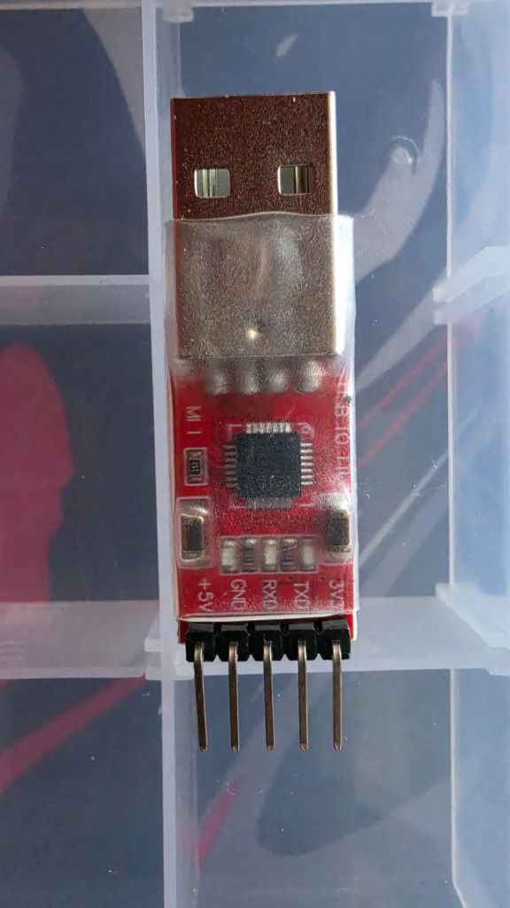
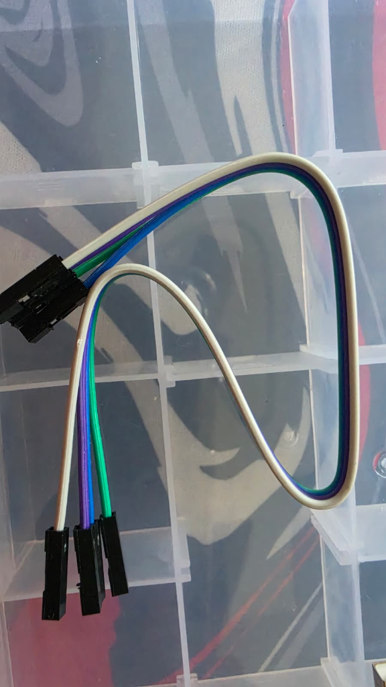

---
tags:
  - hardware
  - componente
  - ficha-tecnica
  - comunicación
fabricante: "Silicon Labs (Chip CP2102)"
estado: "por investigar"
---
# Módulo Convertidor CP2102 (USB a UART TTL)

## 1. Descripción General y Uso
El módulo **CP2102** es un puente convertidor de USB a UART (puerto serial) altamente estable y popular (superior a alternativas chinas como el CH340 o antiguos PL2303). 

En el ecosistema de **Hub Agritech Core**, este componente cubre una de las necesidades detectadas en el **Análisis de Brechas** para pruebas y diagnóstico:
- **Programación de Nodos:** Se usa para "flashear" firmware en microcontroladores crudos o módulos ESP32/ESP8266 que no integran el chip conversor USB en su placa.
- **Depuración Serial:** Permite conectar directamente un sensor industrial (pasando antes por un conversor RS485-TTL) a la computadora del desarrollador por USB para leer las tramas de datos crudas antes de escribir el código definitivo del *Worker Ingesta*.

## 2. Datos Técnicos (Datasheet)
- **Chip Principal:** Silicon Labs CP2102.
- **Voltaje de Nivel Lógico (VIO):** Generalmente cuenta con pines de salida para **3.3V** y **5V**. 
  - ⚠️ **CRÍTICO:** Los microcontroladores modernos como el **ESP32 trabajan estrictamente a 3.3V**. Utilizar el pin de 5V puede destruir permanentemente el ESP32.
- **Protocolo de comunicación:** USB 2.0 (Full-speed) hacia UART TTL asíncrono (Serial).
- **Tasas de transferencia (Baud Rates):** Desde 300 bps hasta 1 Mbps (soportando los 115200 baudios clásicos del ESP32).
- **Regulador Interno:** Incluye un regulador interno que toma los 5V del puerto USB de la PC y los convierte a 3.3V (aunque con una corriente de salida limitada, aprox. 100mA, suficiente para programar, pero a veces insuficiente si el ESP32 enciende antenas Wi-Fi o LoRa simultáneamente).

## 3. Guía de Conexión (Pinout) e Integración
La regla de oro para la comunicación UART (Serial) es que **siempre debe ser cruzada**: el que Transmite (TX) se conecta al que Recibe (RX) y viceversa.

### Código de Colores (Basado en el cable físico de 4 vías)
Se ha adquirido un cable Dupont de 4 salidas con el patrón de colores: **Blanco - Morado - Azul - Verde Turquesa**. Basándonos en la serigrafía del módulo (que tiene 5 pines en el orden: `+5V`, `GND`, `RXD`, `TXD`, `3V3`), y sabiendo que para la mayoría de los módulos como el ESP32 **no se debe conectar el pin de 5V**, el mapeo de conexión seguro usando el cable de 4 vías es el siguiente:

| Pin CP2102 | Color del Cable | Conexión al Microcontrolador (ej. ESP32) | Notas de Seguridad |
| :--- | :--- | :--- | :--- |
| **+5V** | *(Sin conectar)* | **NO CONECTAR** | Peligro de quemar lógica de 3.3V. |
| **GND** | **Blanco** | `GND` | Tierra común obligatoria para que funcione. |
| **RXD** | **Morado** | `TXD` (Pin TX) | Cruce de datos (Módulo recibe, ESP envía). |
| **TXD** | **Azul** | `RXD` (Pin RX) | Cruce de datos (Módulo envía, ESP recibe). |
| **3V3** | **Verde Turquesa** | `3.3V` / `VCC` | Para alimentar la placa si no tiene batería. |

*(Nota: Asegúrate de alinear el conector de plástico negro de 4 vías dejando libre el pin de +5V en un extremo o el pin de 3V3 en el otro, dependiendo de cómo lo enchufes).*

## 4. Recursos, Guías y Multimedia

Para que tu sistema operativo (Windows/Mac/Linux) reconozca este módulo al conectarlo al puerto USB, es casi seguro que debas instalar el "Virtual COM Port (VCP) Driver" oficial.

- **Descarga Oficial de Drivers (VCP):** [Silicon Labs CP210x Drivers](https://www.silabs.com/developers/usb-to-uart-bridge-vcp-drivers)
- **Hoja de Datos (Datasheet PDF):** [CP2102 Datasheet](https://www.silabs.com/documents/public/data-sheets/CP2102-9.pdf)

### Galería de Imágenes (Hardware Adquirido)
*Imágenes del módulo CP2102 físico y su cableado:*

### Video de Referencia (Cómo usar conversores USB-TTL)
*Este tutorial explica visualmente cómo conectar los pines TX/RX entre un conversor como el CP2102 y tu placa, y cómo probarlo en la PC.*

<iframe width="560" height="315" src="https://www.youtube.com/embed/Ixj-B5dI-64" title="Cómo conectar módulo USB a TTL" frameborder="0" allow="accelerometer; autoplay; clipboard-write; encrypted-media; gyroscope; picture-in-picture" allowfullscreen></iframe>
