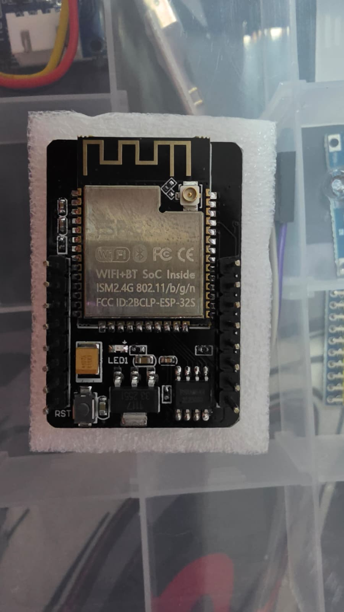
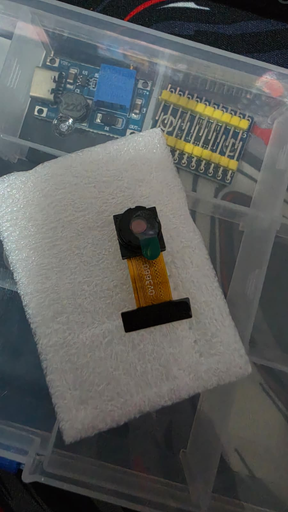
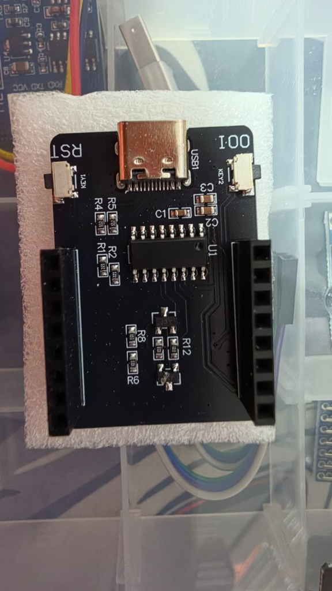

---
tags:
  - hardware
  - componente
  - camara
  - esp32
  - vision
fabricante: "Ai-Thinker / Genérico"
estado: "adquirido"
---
# Kit ESP32-CAM con Lente OV3660 y Placa Base USB-C

## 1. Descripción General y Uso
El módulo **ESP32-CAM** es una placa de desarrollo sumamente popular para proyectos de visión por computadora en el Edge y streaming de video. En el ecosistema de **Hub Agritech Core**, este componente es el encargado principal de los "Nodos de Visión", permitiendo capturar imágenes del cultivo para analizar el crecimiento o detectar plagas localmente mediante Edge AI (TinyML).

Este kit es especial porque consta de tres piezas fundamentales que facilitan enormemente el desarrollo:
1. **La Placa ESP32-CAM (Cerebro):** El módulo con el microcontrolador ESP32-S, antena Wi-Fi/Bluetooth, lector de tarjetas microSD y un potente LED flash.
2. **La Cámara OV3660:** Una mejora sustancial respecto a la OV2640 estándar. Ofrece 3 Megapíxeles y mejor rendimiento en condiciones de luz moderada.
3. **Placa Base Programadora (MB Board):** Una placa base con puerto USB Type-C que se ensambla como un sándwich con la ESP32-CAM. Evita el tedioso proceso de usar un módulo FTDI externo y puentear pines para poner la placa en modo flash.

## 2. Los Componentes del Kit en Detalle

### A. La Placa ESP32-CAM

- **SoC:** ESP32-S (Wi-Fi 802.11 b/g/n y Bluetooth 4.2 LE).
- **Memoria:** 520 KB SRAM interna + 4 MB PSRAM externa (vital para procesar imágenes).
- **Almacenamiento:** Ranura para tarjeta microSD integrada (hasta 4GB nativo, a veces soporta más formateadas en FAT32) para guardar fotos localmente si se pierde la conexión.
- **Antena:** Posee antena PCB integrada y un conector IPEX/U.FL para antena externa de 2.4GHz (ideal para nodos alejados en el campo).

### B. El Módulo de Cámara (OV3660)

- **Resolución:** 3 Megapíxeles (FQXGA 2048x1536).
- **Ventaja:** Mayor ángulo de visión y mejor calidad de imagen que la OV2640 (2 Megapíxeles) que suele venir por defecto en otros kits.
- **Conexión:** Cable plano flex (FPC) de 24 pines que encaja a presión en el zócalo de la placa principal.

### C. La Placa Base Programadora (Motherboard / MB)

- **Puerto:** USB Type-C.
- **Chip Serial:** Incorpora un chip conversor USB a Serial (usualmente CH340).
- **Botones:** `RST` (Reset) y `IO0` (Botón Boot/Flash).
- **Uso:** Al acoplar la ESP32-CAM sobre estos headers hembra, el módulo puede ser flasheado directamente desde el Arduino IDE o PlatformIO sin cables sueltos ni conversores extra.

## 3. Guía de Conexión y Setup
> [!IMPORTANT] Instalación del flex de la cámara
> Levanta con cuidado la pestaña negra del conector FPC de la ESP32-CAM. Inserta el cable flex de la OV3660 asegurándote de que los contactos metálicos del cable estén orientados hacia la placa PCB. Luego presiona la pestaña negra hacia abajo para asegurarlo. ¡Es frágil!

### Configuración en el Entorno de Desarrollo (Arduino IDE / PlatformIO)
Para la **ESP32-CAM (Ai-Thinker)** equipada con sensor **OV3660**, el mapeo de pines a nivel de hardware sigue siendo idéntico al estándar Ai-Thinker (`CAMERA_MODEL_AI_THINKER`). Sin embargo, el sensor OV3660 requiere calibración en los registros de sensor (`sensor_t`) para evitar imágenes invertidas o tintes cromáticos no deseados.

> [!TIP] Firmware Oficial Listo para Usar
> Hemos desarrollado un sketch autónomo y autocontenido con servidor web HTTP, streaming MJPEG fluido, captura de fotos y control de flash en:
> `hub_agritech_core/firmware/nodo_camara_ov3660/nodo_camara_ov3660.ino`

#### Parámetros Críticos del Compilador:
- **Placa:** `AI Thinker ESP32-CAM`
- **Partition Scheme:** `Huge APP (3MB No OTA/1MB SPIFFS)` *(Requerido para alojar el stack de cámara y servidor web)*.
- **PSRAM:** Habilitada por defecto (en Arduino IDE v2 no aparece en el menú porque viene activada en `boards.txt` al elegir la placa `AI Thinker ESP32-CAM`).
- **CPU Frequency:** `240 MHz`.

#### Calibración del Sensor OV3660 tras `esp_camera_init`:
```cpp
sensor_t * s = esp_camera_sensor_get();
if (s != NULL) {
    s->set_vflip(s, 1);        // Volteo vertical (evita imagen invertida)
    s->set_hmirror(s, 0);      // Espejo horizontal
    s->set_brightness(s, 1);   // Ajuste de brillo para interiores/campo
    s->set_saturation(s, -1);  // Corrección cromática para balancear tintes
    s->set_whitebal(s, 1);     // Balance de blancos automático
    s->set_awb_gain(s, 1);
}
```

### Pinout Crítico
La ESP32-CAM sufre de falta de pines libres porque la microSD y la cámara consumen casi todos los GPIOs.
- **GPIO 4:** Controla el LED Flash blanco de alta potencia.
- **GPIO 33:** Controla el pequeño LED indicador rojo de la parte trasera (Active LOW).
- **Cuidado con los pines de la SD:** Si usas la tarjeta microSD en modo de 4 bits, perderás el acceso a los pines 4, 12, 13, 14, 15 y 2. Si necesitas pines libres (para sensores), debes inicializar la SD en modo "1-bit", lo que libera algunos pines pero reduce la velocidad de escritura.

## 4. Recursos y Multimedia
- Firmware de prueba y streaming: `hub_agritech_core/firmware/nodo_camara_ov3660/`
- Este nodo es el candidato principal para integrarse con modelos TinyML entrenados en *Edge Impulse* para reconocimiento de estrés hídrico, enfermedades foliares o conteo de frutos directamente en el campo.

