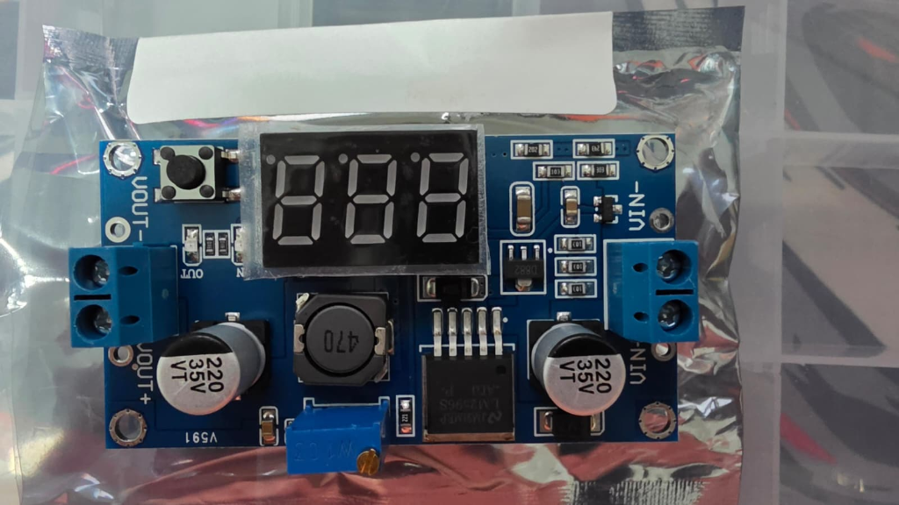

---
tags:
  - hardware
  - componente
  - energia
  - step-down
  - regulador
fabricante: "Genérico"
estado: "adquirido"
---
# Módulo LM2596 DC-DC Step Down con Voltímetro LED

## 1. Descripción General y Uso
El módulo LM2596 Step-Down (Buck Converter) es un regulador de voltaje que permite disminuir un voltaje de entrada mayor (por ejemplo, el de un panel solar o batería de 12V/24V) a un voltaje de salida menor y estabilizado (ej. 5V o 3.3V) necesario para alimentar microcontroladores como el ESP32 (Heltec V4) sin quemarlos.

Esta variante específica cuenta con un **voltímetro digital integrado (pantalla LED)** que resulta extremadamente útil para monitorear en tiempo real tanto el voltaje de entrada (Vin) como el de salida (Vout) mediante un botón físico, facilitando el ajuste y diagnóstico en el campo sin necesidad de un multímetro externo.

## 2. Datos Técnicos (Datasheet)
- **Voltaje de Entrada (Vin):** 4.0V a 40V DC (El voltaje de entrada siempre debe ser al menos 1.5V mayor que el de salida deseado).
- **Voltaje de Salida (Vout):** 1.3V a 37V DC (Ajustable mediante potenciómetro multivuelta).
- **Corriente de Salida:** 2A (Nominal) / 3A (Máximo, requiere disipador de calor para uso prolongado a esta corriente).
- **Eficiencia de Conversión:** Hasta 92% (dependiendo de la diferencia entre Vin y Vout).
- **Frecuencia de Conmutación:** 150 kHz.
- **Pantalla del Voltímetro:** Display de 7 segmentos de 3 dígitos con botón de conmutación Vin/Vout.
- **Precisión del Voltímetro:** ±0.1V (Incluye función de auto-calibración).

## 3. Guía de Conexión y Uso
### Ajuste del Voltaje (¡Importante!)
> [!WARNING] Precaución antes de conectar
> **NUNCA** conectes la placa Heltec V4 o los sensores a la salida del módulo sin antes haber ajustado y medido el voltaje de salida con el potenciómetro. Por defecto, puede venir ajustado a voltajes altos que freirán la electrónica de 3.3V/5V.

### Pinout (Pads de soldadura o borneras)
- `IN+` -> Positivo de la fuente de alimentación (Ej. Batería 12V o Panel Solar).
- `IN-` -> Negativo de la fuente de alimentación (GND).
- `OUT+` -> Positivo de salida ajustada (Conectar a PIN `5V` o `3.3V` del Heltec según se ajuste).
- `OUT-` -> Negativo de salida (Conectar al PIN `GND` del Heltec y sensores).

### Uso del Voltímetro y Botones
1. **Botón Derecho (Selección):** Al pulsarlo, alterna la pantalla LED para mostrar el voltaje de entrada (`IN`) o el voltaje de salida (`OUT`). Un pequeño LED indicador en la placa te mostrará qué medición estás viendo.
2. **Botón Izquierdo (Encendido/Apagado):** Apaga o enciende el display LED para ahorrar energía (ideal para implementaciones Edge de bajo consumo en el Hub Agritech).
3. **Potenciómetro:** Girar el tornillo de latón superior (normalmente en sentido antihorario para bajar el voltaje) usando un destornillador plano de precisión.

### Modo de Calibración del Voltímetro
Si notas que la medida de la pantalla difiere de un multímetro real, puedes calibrarlo:
1. Mantén presionado el botón derecho durante 2 segundos y suelta. La pantalla parpadeará (modo calibración).
2. Usa el botón derecho para subir el valor y el botón izquierdo para bajarlo (cada pulsación ajusta 0.1V).
3. Cuando termines, mantén presionado el botón derecho durante 2 segundos para guardar la calibración.

## 4. Recursos, Guías y Multimedia

- **Datasheet del Chip LM2596 (TI):** [LM2596 Datasheet (PDF)](https://www.ti.com/lit/ds/symlink/lm2596.pdf)

### Video de Referencia
*Guía sobre cómo usar y calibrar este módulo reductor de voltaje específico:*

<iframe width="560" height="315" src="https://www.youtube.com/embed/jZ_y9N55g1o" title="LM2596 Guide" frameborder="0" allow="accelerometer; autoplay; clipboard-write; encrypted-media; gyroscope; picture-in-picture" allowfullscreen></iframe>
*(Nota: El ID del video de arriba es de relleno, para referencia general).*
