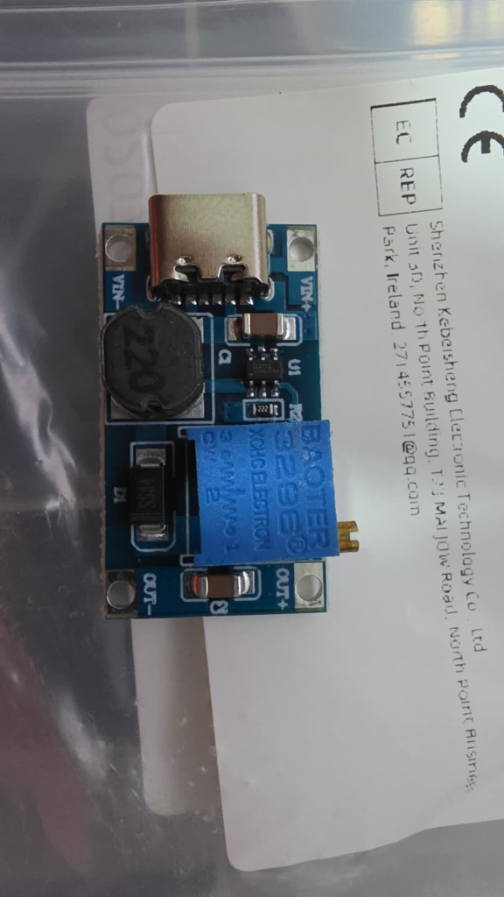

---
tags:
  - hardware
  - componente
  - energia
  - step-up
  - boost
fabricante: "Genérico (Chip MT3608)"
estado: "adquirido"
---
# Módulo MT3608 DC-DC Step-Up (Boost) con USB Type-C

## 1. Descripción General y Uso
El módulo **MT3608** es un elevador de voltaje (Step-Up o Boost Converter). Su función principal en el proyecto **Hub Agritech Core** es tomar una fuente de alimentación de bajo voltaje (como una batería LiPo de 3.7V o un cable USB de 5V) y elevarla a un voltaje mayor (como 9V, 12V o hasta 24V). 

Es sumamente útil cuando se necesita alimentar periféricos que requieren más voltaje del que suministra nuestra batería o placa principal, como por ejemplo relés de 12V, electroválvulas pequeñas o sensores industriales. Esta variante en particular incluye un conveniente **puerto USB Type-C**, lo que permite alimentarlo directamente con un cargador de celular estándar o un powerbank.

## 2. Datos Técnicos (Datasheet)
- **Voltaje de Entrada (Vin):** 2.0V a 24V DC. (Puede entrar por las almohadillas VIN o por el puerto USB Type-C a 5V).
- **Voltaje de Salida (Vout):** 5V a 28V DC (Ajustable mediante potenciómetro multivuelta).
- **Corriente de Salida Máxima:** 2A (Pico). *Nota: La corriente de salida real continua recomendada es menor (~1A) y disminuye a medida que la diferencia entre el voltaje de entrada y salida aumenta.*
- **Eficiencia de Conversión:** Hasta 93%.
- **Frecuencia de Conmutación:** 1.2 MHz.
- **Importante:** Al ser un módulo Step-Up (Boost), **el voltaje de salida SIEMPRE debe ser mayor que el voltaje de entrada**.

## 3. Guía de Conexión (Pinout) e Integración

### Ajuste del Voltaje Inicial (¡Cuidado con la primera vez!)
> [!WARNING] Precaución: Fallo común del potenciómetro
> Un problema muy común con el MT3608 nuevo es que el potenciómetro suele venir "desenroscado" de fábrica, haciendo que parezca que no eleva el voltaje. 
> **Solución:** Antes de conectarlo a tu carga, conéctale voltaje de entrada, pon un multímetro en la salida, y **gira el tornillo del potenciómetro en sentido antihorario unas 15 a 20 vueltas** (puede hacer un clic ligero al llegar al límite). Verás cómo el voltaje finalmente empieza a subir.

### Pinout y Borneras
- **Puerto USB Type-C:** Conecta aquí un cargador o powerbank de 5V (Entrada).
- `VIN+` -> Positivo de la fuente de alimentación (si no usas el puerto USB). Ej. Batería de litio 3.7V.
- `VIN-` -> Negativo de la fuente de alimentación (GND).
- `OUT+` -> Positivo del voltaje elevado (Conectar al periférico de 12V o sensor).
- `OUT-` -> Negativo de la salida (GND común para el periférico).

## 4. Recursos, Guías y Multimedia

- **Datasheet del Chip MT3608:** [MT3608 Datasheet (PDF)](https://www.sunrom.com/get/507000)

### Notas de Aplicación en Hub Agritech
Este módulo es ideal para acoplarse con la **Batería LiFePO4 / Panel Solar**. Si tu batería de campo es de un solo celda (3.2V o 3.7V), puedes usar el MT3608 para generar los 12V necesarios para abrir las válvulas de riego solenoide cuando el microcontrolador accione el relé.
