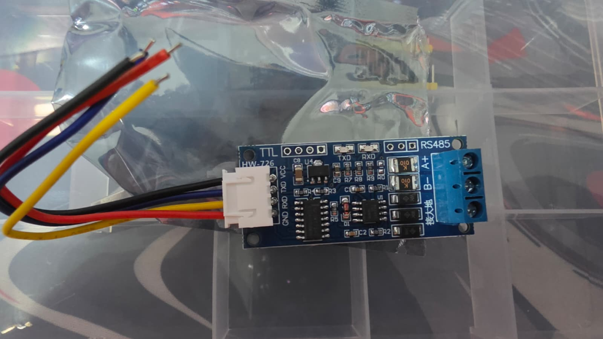
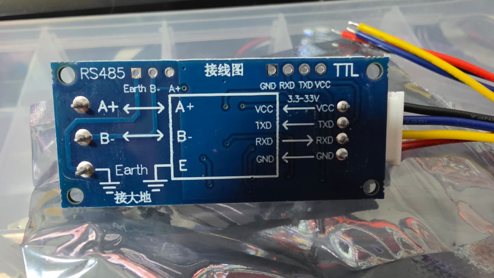

---
tags:
  - hardware
  - componente
  - rs485
  - conversor
  - uart
fabricante: "Genérico (HW-726 / Auto-flow)"
estado: "adquirido"
---
# Módulo Conversor TTL a RS485 (Auto Flow Control)

## 1. Descripción General y Uso
Este módulo (frecuentemente marcado como HW-726) permite a un microcontrolador con puertos UART TTL (como el ESP32 en el Heltec V4) comunicarse con redes y sensores industriales que utilizan el protocolo RS485 (como los sensores de humedad y NPK de suelo).

La mayor ventaja de esta versión específica frente a los conversores MAX485 tradicionales es que incluye **Auto Flow Control (Control automático de flujo de dirección)**. En los módulos básicos se requieren pines adicionales (DE/RE) para decirle al chip cuándo transmitir y cuándo recibir. Este módulo detecta automáticamente la dirección del flujo de datos a través de su hardware interno, ahorrando pines GPIO en el microcontrolador y simplificando drásticamente el código de programación.

## 2. Datos Técnicos
- **Voltaje de Alimentación (VCC):** Amplio rango de **3.3V a 33V DC** (Cuenta con regulador integrado, haciéndolo compatible directamente con los 3.3V del ESP32 o fuentes de 12V/24V industriales).
- **Nivel Lógico (TTL):** Compatible con señales lógicas de 3.3V y 5V.
- **Protocolo Industrial:** RS-485 (Half-duplex, diferencial).
- **Distancia de transmisión:** Hasta 1000 metros (dependiendo del tipo de cableado RS485 y ruido electromagnético).
- **Topología de red:** Soporta conectar múltiples dispositivos en el mismo bus RS485 (Multidrop).
- **Control de Dirección:** Automático (Hardware Auto-Flow). No requiere manipular pines de Enable.

## 3. Guía de Conexión y Pinout
El módulo viene con un conector JST de 4 pines pre-cableado. Basado en las imágenes de la parte trasera del módulo, el mapeo de colores exacto de tu cable es:

### Lado del Microcontrolador (Cable de 4 hilos JST)
> [!CAUTION] ¡PELIGRO DE COLORES INVERTIDOS!
> El cable JST incluido de fábrica viene con un código de colores que **viola el estándar**. Como notaste correctamente en la placa física, el cable rojo está en GND y el cable negro en VCC. **Fíate SIEMPRE de la serigrafía de la placa trasera y no de la intuición de los colores.**

| Pin Módulo (Serigrafía Trasera) | Color del Cable Físico | Conexión al Microcontrolador (Heltec V4) | Notas                                                     |
| :------------------------------ | :--------------------- | :--------------------------------------- | :-------------------------------------------------------- |
| **VCC** (Pin Superior)          | **Negro**              | 3.3V o 5V                                | Alimentación del módulo. *(Cuidado, es negro)*            |
| **TXD** (2do Pin)               | **Azul**               | Pin RX del ESP32                         | **¡Importante!** El pin TX del módulo va al RX del ESP32. |
| **RXD** (3er Pin)               | **Amarillo**           | Pin TX del ESP32                         | El pin RX del módulo va al TX del ESP32.                  |
| **GND** (Pin Inferior)          | **Rojo**               | GND (Tierra común)                       | Cerrar el circuito. *(Cuidado, es rojo)*                  |

### Lado Industrial (Borneras RS485)
- **A+ (A / D+)**: Conectar al cable de señal `A` o `D+` del sensor RS485.
- **B- (B / D-)**: Conectar al cable de señal `B` o `D-` del sensor RS485.
- **Earth (Tierra / Malla)**: Pin opcional para conectar la malla de apantallamiento de cables RS485 de larga distancia (ayuda a drenar ruido a tierra física).

> [!TIP] Uso con Modbus-RTU
> Ya que este módulo maneja el control de flujo automáticamente, al programar la lectura de tus sensores NPK usando librerías de `ModbusMaster` en Arduino/PlatformIO, no necesitas configurar las funciones `preTransmission` y `postTransmission` que habitualmente cambian los pines DE/RE a HIGH o LOW. Simplemente envías los datos por `Serial.write()`.

## 4. Recursos y Referencias
Este componente elimina una gran barrera de entrada al IoT industrial, ya que vuelve la comunicación RS485 totalmente transparente para el ESP32, operando exactamente igual que si estuvieras usando un simple puerto Serial estándar.
