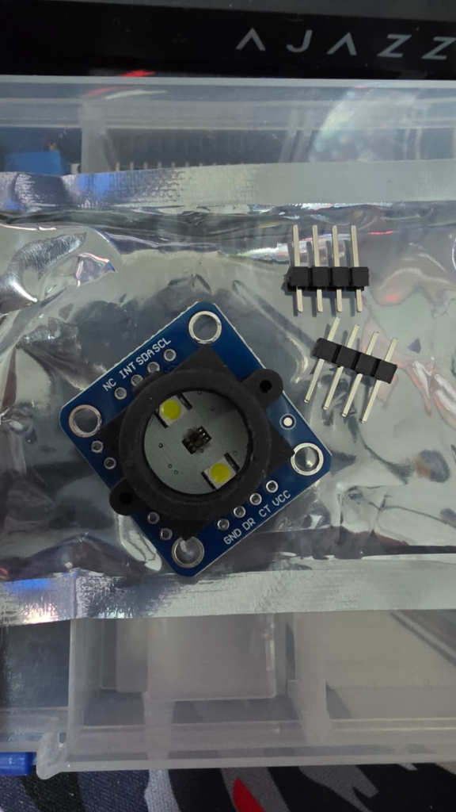
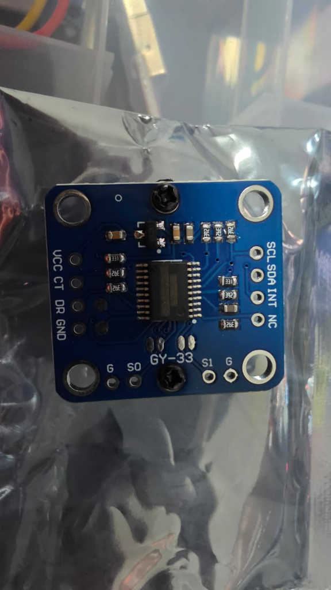

---
tags:
  - hardware
  - componente
  - sensor
  - optico
  - color
fabricante: "Genérico (Chip TCS34725 + MCU)"
estado: "adquirido"
---
# Módulo Sensor de Color GY-33 (TCS34725)

## 1. Descripción General y Uso
El módulo **GY-33** es un sensor de reconocimiento de color avanzado que reemplaza a sensores más antiguos como el TCS230 o TCS3200. En el centro del módulo se encuentra el chip sensor óptico **TCS34725**, el cual cuenta con un filtro de bloqueo de luz infrarroja (IR) que le permite percibir los colores de manera muy similar a como lo hace el ojo humano.

Lo que hace especial a la versión GY-33 es que **incluye un microcontrolador integrado** que lee los datos del sensor y los procesa por ti. Esto significa que puedes recibir directamente los valores RGB u obtener el color calculado a través del puerto Serial (UART) o I2C, aliviando la carga de procesamiento del microcontrolador principal (ESP32). Posee además dos LEDs blancos de alto brillo para iluminar el objetivo de manera controlada y un cono de sombra para evitar fugas de luz.

## 2. Datos Técnicos
- **Voltaje de Alimentación (VCC):** 3.3V a 5V DC.
- **Nivel Lógico de Datos:** 3.3V (Totalmente compatible de forma directa con el ESP32).
- **Chip Sensor Principal:** TCS34725 (Soporta mediciones de luz roja, verde, azul (RGB) y luz clara).
- **Filtro Infrarrojo:** Sí, integrado en el chip para mayor precisión de color.
- **Modos de Comunicación:**
  - **Serial (UART):** A través del chip procesador del módulo (Modo por defecto).
  - **I2C Procesado:** A través del chip procesador del módulo.
  - **I2C Directo:** Acceso directo y crudo al chip TCS34725, saltándose el procesador del módulo.
- **Baudrate por defecto (UART):** 9600 bps.

## 3. Guía de Conexión (Pinout) e Integración
Este módulo posee dos conjuntos de 4 pines, cada uno con una función distinta dependiendo de si quieres usar el procesador del módulo o leer el chip de forma cruda.

### Conexión Estándar (Modo Serial UART / Procesado) - Pines Inferiores
Esta es la manera recomendada y más fácil de usarlo en el Hub Agritech, ya que el módulo hace el cálculo matemático del color por ti.

| Pin del Módulo | Conexión al ESP32 / Heltec | Función |
| :--- | :--- | :--- |
| **VCC** | 3.3V o 5V | Alimentación de energía. |
| **CT** | Pin RX del ESP32 | **Transmit (TX) del módulo**. Por aquí envía los datos del color en formato Serial. |
| **DR** | Pin TX del ESP32 | **Receive (RX) del módulo**. Recibe comandos de configuración (ej. encender/apagar LEDs). |
| **GND** | GND | Tierra común. |

### Configuración de los Modos (Pads S0 y S1)
En la parte trasera de la placa encontrarás unos pequeños pads de soldadura etiquetados como `G`, `S0`, `S1` y `G`. Estos determinan cómo opera el microcontrolador del GY-33:

- **Pad S0 (Modo de Comunicación):** 
  - **Desconectado / Abierto (Por defecto):** El módulo se comunica por **Serial UART** usando los pines `CT` (TX) y `DR` (RX).
  - **Puenteado a G (GND):** El módulo se comunica por **I2C**, cambiando la función de los pines inferiores a `CT` (SCL) y `DR` (SDA).
- **Pad S1 (Acceso Directo):**
  - **Desconectado / Abierto (Por defecto):** El microprocesador del módulo está activo procesando el color.
  - **Puenteado a G (GND):** Apaga el microprocesador interno. Obligatorio si quieres usar los pines superiores (`SCL`, `SDA`) para hablar directamente con el chip TCS34725 saltándote el procesamiento del módulo.

### Conexión Directa al Sensor (Modo I2C Nativo) - Pines Superiores
Usa estos pines si prefieres usar la librería clásica de `Adafruit_TCS34725` y procesar todo tú mismo.

| Pin del Módulo | Conexión | Función |
| :--- | :--- | :--- |
| **SCL** | Pin SCL (I2C) | Reloj I2C directo al chip TCS34725. |
| **SDA** | Pin SDA (I2C) | Datos I2C directo al chip TCS34725. |
| **INT** | Pin GPIO / Interrupción | Pin de interrupción programable (opcional). |
| **NC** | No Conectar | Pin sin conexión interna. |

## 4. Casos de Uso en Hub Agritech
Este sensor es ideal para medir la **salud del cultivo** o la **maduración de los frutos**.
Al encapsular el sensor apuntando hacia una muestra vegetal, el sistema puede identificar si una hoja está presentando clorosis (tonos amarillentos) o medir el índice exacto de rojo de un fruto para determinar si ya alcanzó su punto de cosecha óptimo, complementando así las predicciones del modelo de Machine Learning (TinyML).
