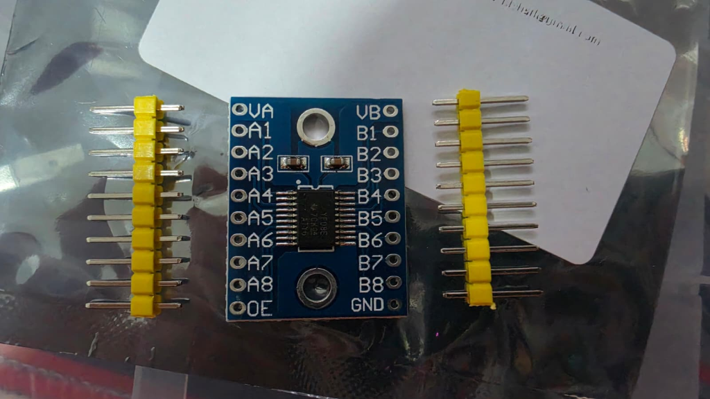

---
tags:
  - hardware
  - componente
  - convertidor
  - nivel-logico
  - txs0108e
fabricante: "Genérico (Chip TI TXS0108E)"
estado: "adquirido"
---
# Módulo Convertidor de Nivel Lógico Bi-direccional TXS0108E (8 Canales)

## 1. Descripción General y Uso
El TXS0108E es un conversor de niveles lógicos (logic level shifter) bi-direccional de 8 canales. Su propósito en el proyecto **Hub Agritech Core** es permitir la comunicación segura entre componentes que operan a diferentes voltajes lógicos, como el microcontrolador Heltec V4 (que funciona a 3.3V) y periféricos o sensores que requieren o envían señales a 5V.

A diferencia de conversores más simples basados en MOSFETs, el chip TXS0108E detecta automáticamente la dirección de los datos (sin necesidad de un pin de control de dirección) y soporta velocidades de transmisión de datos mucho más altas, siendo compatible tanto con configuraciones push-pull (como SPI o UART) como open-drain (como I2C).

## 2. Datos Técnicos (Datasheet)
- **Voltaje del lado de baja tensión (VCCA):** 1.2V a 3.6V (Típicamente 3.3V del ESP32).
- **Voltaje del lado de alta tensión (VCCB):** 1.65V a 5.5V (Típicamente 5V).
- **Condición estricta:** VCCB debe ser siempre mayor o igual a VCCA.
- **Canales de conversión:** 8 líneas bi-direccionales independientes (A1-A8 hacia B1-B8).
- **Velocidad de datos (Data Rate):** 
  - Hasta 110 Mbps en modo push-pull (ej. SPI).
  - Hasta 1.2 Mbps en modo open-drain (ej. I2C).
- **Auto-dirección:** No requiere un pin extra para indicar si se está leyendo o escribiendo; el chip lo detecta dinámicamente.

## 3. Guía de Conexión (Pinout) e Integracin
Para usar este módulo correctamente en la placa de desarrollo, sigue esta guía de pines:

| Pin del Módulo | Conexión recomendada | Notas |
| :--- | :--- | :--- |
| **VCCA** | 3.3V (Desde el Heltec V4) | Alimentación del lado de baja tensión. |
| **VCCB** | 5V (Desde la fuente / Regulador LM2596) | Alimentación del lado de alta tensión. |
| **GND** | GND (Tierra común) | **Obligatorio:** Conectar a la tierra tanto del lado 3.3V como del lado 5V. |
| **OE (Output Enable)**| 3.3V (VCCA) | **Activo en ALTO.** Debe estar conectado a VCCA para que el módulo funcione. Si se deja flotando, los pines entran en alta impedancia (desactivados). |
| **A1 - A8** | GPIOs del Heltec V4 (3.3V) | Entradas/Salidas de baja tensión. |
| **B1 - B8** | Pines del sensor a 5V | Entradas/Salidas de alta tensión (corresponden directamente al canal A respectivo). |

> [!WARNING] Precauciones de uso (Troubleshooting)
> - **Cables muy largos:** El TXS0108E puede presentar oscilaciones de señal (ruido) si los cables Jumper Dupont son excesivamente largos. Mantén las conexiones cortas.
> - **Pull-ups externos:** El chip ya integra resistencias pull-up dinámicas. Si tus sensores I2C de 5V ya tienen resistencias pull-up muy fuertes instaladas, podrían interferir con la detección de dirección automática del TXS0108E.

## 4. Recursos, Guías y Multimedia

- **Datasheet del Chip TXS0108E (TI):** [Texas Instruments TXS0108E](https://www.ti.com/lit/ds/symlink/txs0108e.pdf)
- **Notas de Aplicación:** Ideal para adaptar interfaces SPI para pantallas externas, tarjetas SD, o sensores seriales robustos de 5V hacia la lógica de 3.3V del ESP32.
