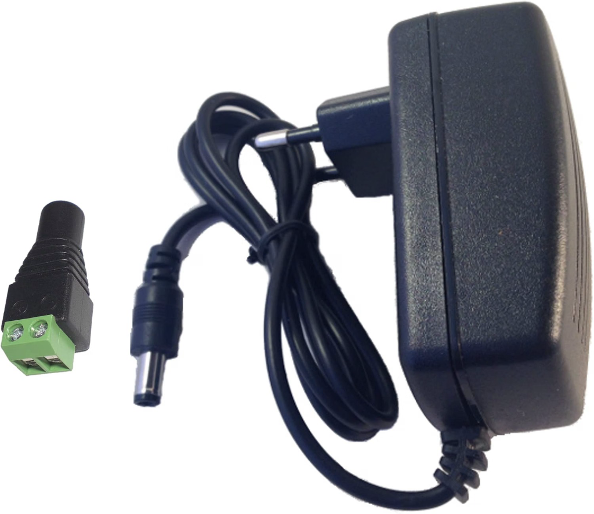
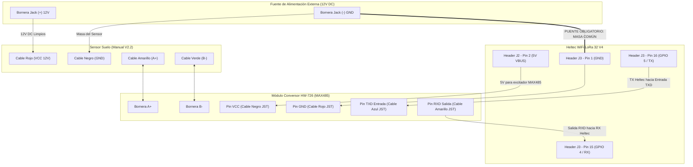

---
tags:
  - hardware
  - componente
  - sensor
  - rs485
  - modbus
  - agricultura
fabricante: "Genérico Industrial (Manual V2.2)"
estado: "adquirido_y_validado"
---
# Sensor de Suelo Multi-paramétrico (RS485 Modbus-RTU - Manual V2.2)

## 1. Descripción General y Uso
El **Sensor Multiparámétrico de Suelo** (comúnmente llamado 7 en 1 u 8 parámetros) es el componente de campo más robusto e importante para el monitoreo agrícola en **Hub Agritech Core**. A diferencia de los sensores analógicos de suelo convencionales que se degradan rápidamente, este dispositivo cuenta con un encapsulado sellado con resina epoxi (grado industrial IP68) y cinco sondas de acero inoxidable 316L que garantizan resistencia a corrosión y estabilidad operativa prolongada bajo tierra.

Mide de manera simultánea hasta 8 variables agronómicas críticas:
1. **Temperatura del suelo** (Termistor NTC de alta precisión con ADC de 12 bits)
2. **Humedad volumétrica** (Basado en FDR - Frequency Domain Reflectometry)
3. **Conductividad Eléctrica (EC)** (Excitación PWM complementaria con puente de medida)
4. **Salinidad (Salt)** (Contenido de sales derivado de EC y compensado a 25°C)
5. **Nitrógeno (N)** (mg/kg)
6. **Fósforo (P)** (mg/kg)
7. **Potasio (K)** (mg/kg)
8. **pH del suelo** (Celda galvánica zinc-aluminio)


---

## 2. Datos Técnicos Oficiales (Manual V2.2)

- **Voltaje de Alimentación:** DC **3.3V a 24V** (**Requerido 12V DC nominal** para garantizar excitación estable de las sondas y compatibilidad de línea larga). *Validado en banco de pruebas con 12.5V DC.*
- **Consumo Energético:** Corriente estática `< 3mA` a 12V; Corriente durante medición: `25mA` (Pico máximo `35mA`). Apto para nodos de bajo consumo con ciclos de Deep Sleep.
- **Grado de Protección:** IP68 (Sumergible, apto para enterramiento directo).
- **Dimensiones de Sonda:** Longitud 60 mm, diámetro 3 mm, acero 316L.
- **Tiempo de Estabilización:** Temperatura, humedad y EC `< 5s`. Primera lectura de pH `> 5 min`.
- **Protocolo de Comunicación:** RS485 Modbus-RTU estándar.
- **Dirección de Esclavo por Defecto:** **`0x02`** (Dirección Broadcast universal del fabricante: **`0x00`**).
- **Velocidad de Comunicación (Baudrate):** **`9600 bps`** (8 Data bits, No parity, 1 Stop bit: `9600 8N1`).

> [!WARNING] Lectura de NPK y Salinidad
> En estos sensores multiparamétricos industriales, **los valores de NPK son aproximaciones derivadas matemáticamente** de la Conductividad Eléctrica (EC) y humedad. Son excelentes para seguir curvas y tendencias de fertilización en campo, pero no reemplazan análisis químicos periódicos de laboratorio.

---

## 3. Esquema Eléctrico y Cableado Validado

Para la puesta en marcha con la placa **Heltec WiFi LoRa 32 V4**, se utiliza una fuente externa conmutada de **12V DC**, un adaptador Jack con bornera de tornillos y el transceptor **[[Módulo_RS485_a_TTL_Auto_Flow|Módulo Conversor TTL a RS485 (HW-726 con MAX485)]]**.


*Alimentación con adaptador de pared 12V DC hacia bornera de tornillo.*

### Reglas de Oro Eléctricas Aprendidas en Campo

> [!CAUTION] 1. TIERRA COMÚN (COMMON GROUND) OBLIGATORIA
> El polo **Negativo (-)** de la fuente de 12V **DEBE estar puenteado al pin GND del Heltec V4**. Sin esta referencia compartida, las tierras flotan, el límite de modo común del RS485 (-7V a +12V) se satura y el microcontrolador recibe exactamente 0 bytes.

> [!IMPORTANT] 2. ALIMENTACIÓN DEL CHIP MAX485 A 5V
> El módulo conversor HW-726 incorpora un chip transceptor **MAX485**, cuyo umbral de funcionamiento de catálogo es `4.75V a 5.25V`. **No alimentarlo a 3.3V**. Conectar su pin `VCC` directamente al pin **`5V` del Heltec V4** (Header J2, Pin 2, alimentado por USB-C).

> [!WARNING] 3. PINES UART: CUIDADO CON U0TXD / U0RXD
> No conectar a los pines serigrafiados como `U0TXD` y `U0RXD` (Header J2, pines 5 y 6): esos pertenecen al puerto USB nativo de depuración (UART0). El puerto RS485 del firmware corre en **GPIO 4 (RX)** y **GPIO 5 (TX)** ubicados en el **Header J3, pines físicos 15 y 16**.

### Diagrama Esquemático de Conexión



### Tabla de Cableado Físico Detallada

| Desde | Terminal / Color | Hacia | Terminal / Pin | Función Eléctrica |
| :--- | :--- | :--- | :--- | :--- |
| **Fuente 12V** | Bornera Jack **`(+)`** | **Sensor** | **Cable Rojo** | Alimentación 12V DC para excitación del sensor. |
| **Fuente 12V** | Bornera Jack **`(-)`** | **Sensor** | **Cable Negro** | Retorno de corriente del sensor. |
| **Fuente 12V** | Bornera Jack **`(-)`** | **Heltec V4** | **Pin `GND`** | **Tierra común de referencia (0V Compartido).** |
| **Sensor** | **Cable Amarillo** | **HW-726** | **Bornera `A+`** | Señal diferencial RS485 D+. |
| **Sensor** | **Cable Verde** | **HW-726** | **Bornera `B-`** | Señal diferencial RS485 D-. |
| **Heltec V4** | **Header J2 - Pin 2 (`5V`)** | **HW-726** | **VCC (Cable Negro JST)** | Alimentación nominal de 5V requerida por el chip MAX485. |
| **Heltec V4** | **Header J3 - Pin 1 (`GND`)** | **HW-726** | **GND (Cable Rojo JST)** | Masa de lógica TTL. |
| **Heltec V4** | **Header J3 - Pin 16 (`GPIO 5`)**| **HW-726** | **TXD (Cable Azul JST)** | **Salida TX del ESP32** conectada a la entrada `<--- TXD` del módulo. |
| **Heltec V4** | **Header J3 - Pin 15 (`GPIO 4`)**| **HW-726** | **RXD (Cable Amarillo JST)**| **Entrada RX del ESP32** conectada a la salida `---> RXD` del módulo. |

> [!NOTE] Sentido de las flechas en el HW-726
> En la serigrafía trasera del módulo HW-726 (`接线图`):
> * `TXD <--- TXD` (Cable Azul) indica que la señal **entra** desde el microcontrolador (va al pin TX del Heltec).
> * `RXD ---> RXD` (Cable Amarillo) indica que la señal **sale** hacia el microcontrolador (va al pin RX del Heltec).

---

## 4. Estructura de Tramas y Registros Modbus-RTU

### Trama de Consulta Maestra (Master $\rightarrow$ Sensor)
Para leer los 8 parámetros agronómicos simultáneamente, se utiliza el código de función **`0x03` (Read Holding Registers)** pidiendo **8 registros (`0x0008`)**:

- **Trama Oficial para Dirección de Fábrica `0x02` (Recomendada):**
  ```text
  0x02 0x03 0x00 0x00 0x00 0x08 0x44 0x3F
  ```
- **Trama Oficial Broadcast `0x00` (Si se desconoce la dirección esclava):**
  ```text
  0x00 0x03 0x00 0x00 0x00 0x08 0x45 0xDD
  ```

### Mapa de Registros de Salida (Offset 0x0000)

| Registro Hex | Parámetro | R/W | Unidad | Conversión / Formato |
| :--- | :--- | :--- | :--- | :--- |
| **`0x0000`** | **Temperatura del suelo** | R | °C | `Valor / 10.0` (Entero con signo, complemento a 2 para temp negativas) |
| **`0x0001`** | **Humedad del suelo** | R | % | `Valor / 10.0` (0.0% a 100.0%) |
| **`0x0002`** | **Conductividad (EC)** | R | µS/cm | Valor entero directo (0 a 20.000 µS/cm) |
| **`0x0003`** | **Salinidad (Salt)** | R | mg/L | Valor entero directo (`0x0000` en sondas 7-en-1; ver nota técnica) |
| **`0x0004`** | **Nitrógeno (N)** | R | mg/kg | Valor entero directo |
| **`0x0005`** | **Fósforo (P)** | R | mg/kg | Valor entero directo |
| **`0x0006`** | **Potasio (K)** | R | mg/kg | Valor entero directo |
| **`0x0007`** | **pH del suelo** | R | pH | `Valor / 10.0` (3.0 a 9.0 pH) |

> [!NOTE] Comportamiento Físico del Registro 3 (Salinidad) y Derivación Agronómica
> En las sondas físicas comercializadas como modelo **7 en 1**, el microcontrolador interno del sensor deja el **Registro 3 sin inicializar (`0x0000`)**, ya que la salinidad nativa está reservada para variantes específicas de firmware.
> En ensayos de validación (inmersión en agua salina), se comprobó que la **Conductividad Eléctrica (EC) reacciona de forma inmediata y nítida** (p. ej. salto de 1050 a 1255 µS/cm), mientras que el Registro 3 permanece en `0`.
> Siguiendo el **Manual Oficial V2.2 (pág. 1 y 4)** y el estándar agronómico internacional, la Salinidad (TDS / sales disueltas en mg/L) se deriva de la Conductividad Eléctrica compensada a 25°C mediante la fórmula:
> $$\text{Salinidad (mg/L)} = \text{Conductividad Eléctrica (EC en } \mu\text{S/cm)} \times 0.5$$
> *(Ejemplo oficial del fabricante: $\text{EC} = 800\ \mu\text{S/cm} \longrightarrow \text{Salinidad} = 400\ \text{mg/L}$)*.
> El firmware [`emisor_nodo.ino`](file:///h:/Proyectos/hub_agritech_core/firmware/emisor_nodo/emisor_nodo.ino) y los scripts de ingesta implementan este cálculo como respaldo automático cuando `Reg 3 == 0` y `EC > 0`.

### Estructura de Respuesta del Sensor (21 Bytes)
Cuando el sensor recibe la trama, responde con una ráfaga de **21 bytes**:
```text
[Addr] [0x03] [0x10] [T_H T_L] [H_H H_L] [EC_H EC_L] [Sal_H Sal_L] [N_H N_L] [P_H P_L] [K_H K_L] [pH_H pH_L] [CRC_L] [CRC_H]
```
* **Byte 0:** Dirección del esclavo (`0x02`).
* **Byte 1:** Código de función (`0x03`).
* **Byte 2:** Longitud de datos (`0x10` = 16 bytes de datos).
* **Bytes 3–18:** 8 registros de 16 bits cada uno.
* **Bytes 19–20:** CRC16 Modbus (Low / High).

---

## 5. Implementación en Firmware (Heltec V4)

El firmware [`firmware/emisor_nodo/emisor_nodo.ino`](file:///h:/Proyectos/hub_agritech_core/firmware/emisor_nodo/emisor_nodo.ino) en el repositorio central `hub_agritech_core` implementa el driver validado:

```cpp
// Inicialización del puerto serie para Modbus (9600 bps, 8N1)
modbusSerial.begin(9600, SERIAL_8N1, RS485_RX_PIN, RS485_TX_PIN);

// Trama de solicitud oficial (Addr 02, 8 registros)
const byte query[] = {0x02, 0x03, 0x00, 0x00, 0x00, 0x08, 0x44, 0x3F};
modbusSerial.write(query, sizeof(query));
modbusSerial.flush();
```

El firmware empaqueta las lecturas validadas en un *payload* compacto y las transmite periódicamente a través de la radio LoRa SX1262 (868.0 MHz) hacia el Gateway.
