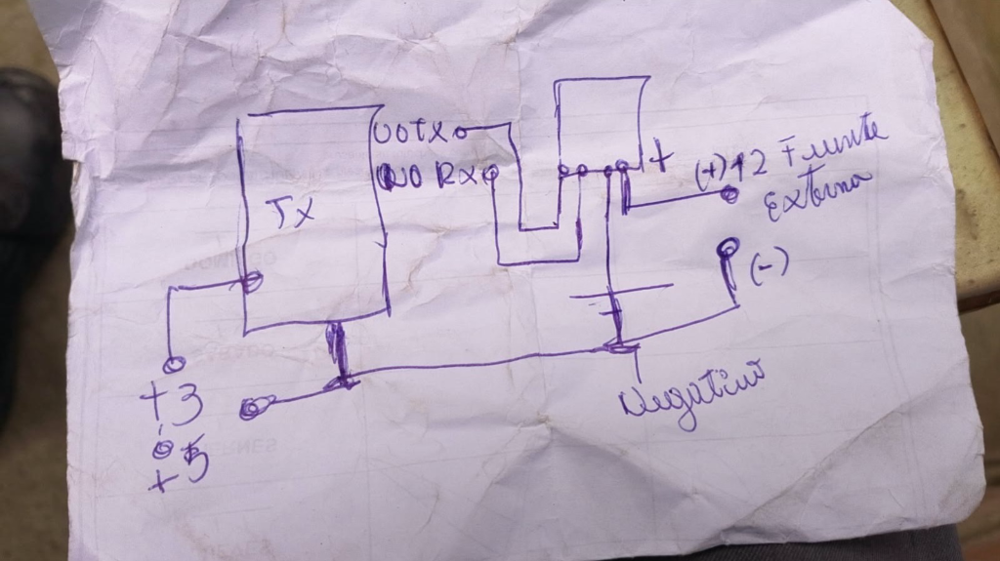

---
tags:
  - hardware
  - componente
  - sensor
  - rs485
  - modbus
  - agricultura
fabricante: "Genérico (JXCT / Jiuxing)"
estado: "adquirido"
---
# Sensor de Suelo 7 en 1 (RS485 Modbus-RTU)

## 1. Descripción General y Uso
El **Sensor Multiparámétrico de Suelo 7 en 1** es el componente de campo más robusto e importante para el monitoreo agrícola en **Hub Agritech Core**. A diferencia de los sensores analógicos de suelo baratos que se corroen en un mes, este sensor tiene un encapsulado sellado con resina (grado IP68) y cinco sondas de acero inoxidable que garantizan precisión y durabilidad prolongada bajo tierra.

Mide de manera simultánea 7 variables críticas para el cultivo:
- **Temperatura del suelo**
- **Humedad (Contenido volumétrico de agua)**
- **Conductividad Eléctrica (EC / Salinidad)**
- **pH (Acidez/Alcalinidad)**
- **Nitrógeno (N)**
- **Fósforo (P)**
- **Potasio (K)**


## 2. Datos Técnicos y Parámetros
- **Voltaje de Alimentación:** 5V a 30V DC (**Requerido 12V DC para operación estable**). Las pruebas en laboratorio demuestran que alimentar el sensor a 5V desde el pin USB del microcontrolador provoca caídas de tensión (*brownout*) e impide que el circuito de excitación de las sondas y su microcontrolador interno arranquen.
- **Protección:** IP68 (Totalmente sumergible e impermeable).
- **Longitud del Cable:** 2 metros por defecto.
- **Protocolo de Comunicación:** RS485 (Requiere el [[Módulo_RS485_a_TTL_Auto_Flow|Módulo Conversor TTL a RS485 (HW-726)]] para conectarlo al ESP32).
- **Baudrate Típico:** 4800 bps o 9600 bps (según el lote del fabricante; el firmware cuenta con auto-escaneo dinámico). Modbus-RTU (8 Data bits, No parity, 1 Stop bit).

> [!WARNING] Aviso sobre la lectura NPK
> En la mayoría de estos sensores industriales genéricos multiparamétricos, **los valores de Nitrógeno, Fósforo y Potasio (NPK) no se miden por análisis químico directo**, sino que son derivados matemáticamente a partir de la Conductividad Eléctrica (EC) y la humedad. Son excelentes para observar *tendencias* en la aplicación de fertilizantes, pero no sustituyen un análisis de laboratorio.

## 3. Esquema de Conexión con Fuente Externa 12V

Para energizar el sensor se utiliza una **fuente de alimentación conmutada de 12V DC** (adaptador de pared) junto a un **conector Jack hembra con bornera de tornillos**:


*Adaptador de 12V DC con bornera de conexión rápida (+ y -).*

### Diagrama Esquemático y Regla de Masa Común (Common Ground)

> [!CAUTION] ¡REGLA DE ORO: TIERRA COMÚN (GND)!
> El polo **Negativo (-)** de la fuente externa de 12V **DEBE** unirse eléctricamente con el pin **GND del Heltec V4**. Sin esta referencia de masa compartida, las señales lógicas RS485/UART flotan y el microcontrolador no puede leer ningún byte.
> **NUNCA** conectes los 12V de la fuente al Heltec ni al HW-726; los 12V van **exclusivamente al cable Rojo del sensor**.


*Boceto de integración: Fuente 12V, sensor de suelo, conversor HW-726 y Heltec V4.*

```mermaid
flowchart TD
    subgraph Fuente["Fuente de Poder Externa (12V DC)"]
        F_POS["Bornera Jack (+) 12V"]
        F_NEG["Bornera Jack (-) GND"]
    end

    subgraph Sensor["Sensor Suelo 7 en 1 (RS485)"]
        S_VCC["Cable Rojo (VCC)"]
        S_GND["Cable Negro (GND)"]
        S_A["Cable Amarillo (A+)"]
        S_B["Cable Verde (B-)"]
    end

    subgraph Conversor["Módulo Conversor HW-726 (Auto-Flow)"]
        M_A["Bornera A+"]
        M_B["Bornera B-"]
        M_VCC["Pin VCC (Cable Negro JST)"]
        M_GND["Pin GND (Cable Rojo JST)"]
        M_TX["Pin TXD (Cable Azul JST)"]
        M_RX["Pin RXD (Cable Amarillo JST)"]
    end

    subgraph Heltec["Heltec WiFi LoRa 32 V4"]
        H_3V3["Pin 3V3"]
        H_GND["Pin GND"]
        H_GPIO4["Pin 4 (RX2)"]
        H_GPIO5["Pin 5 (TX2)"]
    end

    %% Alimentación 12V Sensor
    F_POS -->|12V Directo al Sensor| S_VCC
    F_NEG -->|Tierra del Sensor| S_GND
    F_NEG ===|UNIÓN OBLIGATORIA: MASA COMÚN| H_GND

    %% Comunicación Diferencial RS485
    S_A <--> M_A
    S_B <--> M_B

    %% Alimentación y Lógica 3.3V HW-726
    H_3V3 -->|3.3V Seguro para ESP32| M_VCC
    H_GND --> M_GND
    M_TX -->|Línea RX microcontrolador| H_GPIO4
    M_RX <--|Línea TX microcontrolador| H_GPIO5
```

### Tabla de Cableado Físico Detallada

| Desde Componente | Terminal / Color | Hacia Componente | Terminal / Pin | Función Eléctrica |
| :--- | :--- | :--- | :--- | :--- |
| **Fuente 12V** | Bornera Jack **`(+)`** | **Sensor Suelo** | **Cable Rojo** | Alimentación 12V DC aislada para el sensor. |
| **Fuente 12V** | Bornera Jack **`(-)`** | **Sensor Suelo** | **Cable Negro** | Retorno de corriente del sensor. |
| **Fuente 12V** | Bornera Jack **`(-)`** | **Heltec V4** | **Pin `GND`** | **Tierra Común de Referencia (VITAL).** |
| **Sensor Suelo** | **Cable Amarillo** | **Módulo HW-726** | **Bornera `A+`** | Señal diferencial RS485 A (D+). |
| **Sensor Suelo** | **Cable Verde** | **Módulo HW-726** | **Bornera `B-`** | Señal diferencial RS485 B (D-). |
| **Heltec V4** | **Pin `3V3`** | **Módulo HW-726** | **VCC (Negro JST)** | Alimentación lógica 3.3V (segura para ESP32-S3). |
| **Heltec V4** | **Pin `GND`** | **Módulo HW-726** | **GND (Rojo JST)** | Masa de lógica TTL. |
| **Heltec V4** | **Pin `4`** (Header J3) | **Módulo HW-726** | **TXD (Azul JST)** | Entrada RX UART2 del microcontrolador. |
| **Heltec V4** | **Pin `5`** (Header J3) | **Módulo HW-726** | **RXD (Amarillo JST)** | Salida TX UART2 del microcontrolador. |

> [!WARNING] Ubicación de Pines 4 y 5 en Heltec V4
> En la placa Heltec V4, los pines serigrafiados como **`4`** y **`5`** están situados en la parte **superior derecha** del header J3 (cerca del conector de antena y agujero de montaje), NO en los pines 4 y 5 contando desde abajo.

---

## 4. Registros Modbus-RTU (Código de Función `0x03`)

Trama de consulta enviada por el firmware (8 bytes):
`0x01, 0x03, 0x00, 0x00, 0x00, 0x07, 0x04, 0x08`

| Parámetro | Registro Hex | Conversión | Unidad |
| :--- | :--- | :--- | :--- |
| **Humedad** | `0x0000` | Valor / 10 | % |
| **Temperatura** | `0x0001` | Valor / 10 | °C |
| **Conductividad (EC)**| `0x0002` | Valor directo | µS/cm |
| **pH** | `0x0003` | Valor / 10 | pH |
| **Nitrógeno (N)** | `0x0004` | Valor directo | mg/kg |
| **Fósforo (P)** | `0x0005` | Valor directo | mg/kg |
| **Potasio (K)** | `0x0006` | Valor directo | mg/kg |

---

## 5. Procedimiento de Prueba y Puesta en Marcha

Para validar la lectura sin necesidad de desplegar todo el stack Docker/MQTT:

1. **Flashear Firmware:** Cargar en la placa emisora el sketch `firmware/emisor_nodo/emisor_nodo.ino`.
2. **Conectar USB:** Conectar la placa Heltec V4 al ordenador mediante cable USB-C de datos.
3. **Encender Fuente 12V:** Conectar la fuente externa de 12V a la toma de corriente.
4. **Ejecutar Logger de Debug Local:**
   ```bash
   python lora_debug_logger.py
   ```
   El script capturará las lecturas validadas por el sensor y las volcará en tiempo real tanto en la terminal como en el archivo `sensor_debug_log.txt`.
5. **Verificación en Pantalla OLED:** La pantalla del Heltec V4 cambiará su estado de `Sin datos sensor` a mostrar los valores reales:
   `T: 22.5C  H: 52.1%` / `pH: 6.8  EC: 1180` / `NPK: 35-18-52`.

