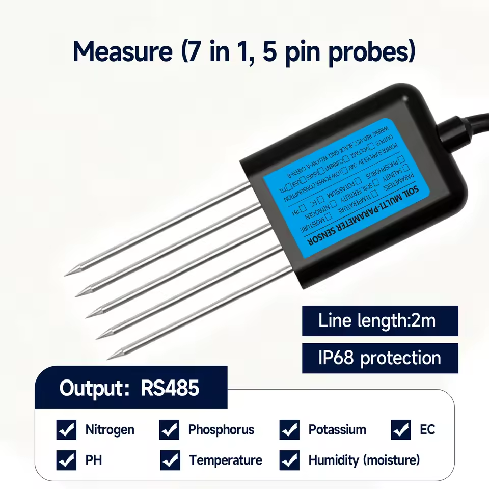

---
tags:
  - hardware
  - componente
  - sensor
  - rs485
  - modbus
  - agricultura
fabricante: "Genérico (JXCT / Jiuxing)"
estado: "adquirido"
---
# Sensor de Suelo 7 en 1 (RS485 Modbus-RTU)

## 1. Descripción General y Uso
El **Sensor Multiparámétrico de Suelo 7 en 1** es el componente de campo más robusto e importante para el monitoreo agrícola en **Hub Agritech Core**. A diferencia de los sensores analógicos de suelo baratos que se corroen en un mes, este sensor tiene un encapsulado sellado con resina (grado IP68) y cinco sondas de acero inoxidable que garantizan precisión y durabilidad prolongada bajo tierra.

Mide de manera simultánea 7 variables críticas para el cultivo:
- **Temperatura del suelo**
- **Humedad (Contenido volumétrico de agua)**
- **Conductividad Eléctrica (EC / Salinidad)**
- **pH (Acidez/Alcalinidad)**
- **Nitrógeno (N)**
- **Fósforo (P)**
- **Potasio (K)**

## 2. Datos Técnicos y Parámetros
- **Voltaje de Alimentación:** 5V a 30V DC (Recomendado 12V/24V, pero suele operar estable a 5V).
- **Protección:** IP68 (Totalmente sumergible e impermeable).
- **Longitud del Cable:** 2 metros por defecto.
- **Protocolo de Comunicación:** RS485 (Requiere el **Módulo Conversor TTL a RS485 (HW-726)** para conectarlo al ESP32).
- **Baudrate Típico:** 4800 bps (o 9600 bps según el lote). Modbus-RTU (8 Data bits, No parity, 1 Stop bit).

> [!WARNING] Aviso sobre la lectura NPK
> En la mayoría de estos sensores industriales genéricos multiparamétricos, **los valores de Nitrógeno, Fósforo y Potasio (NPK) no se miden por análisis químico directo**, sino que son derivados matemáticamente a partir de la Conductividad Eléctrica (EC) y la humedad. Son excelentes para observar *tendencias* en la aplicación de fertilizantes, pero no sustituyen un análisis de laboratorio.

## 3. Guía de Conexión y Mapa de Registros
### Cableado
El cable del sensor viene con 4 hilos pelados:
| Color del Cable | Función | Conexión al Módulo HW-726 RS485 |
| :--- | :--- | :--- |
| **Rojo** | VCC | 5V - 30V DC (Fuente de poder). |
| **Negro** | GND | GND (Asegúrate de unir este GND con el del ESP32). |
| **Amarillo** | RS485 A+ | Bornera A+ del módulo HW-726. |
| **Verde** | RS485 B- | Bornera B- del módulo HW-726. |

### Registros Modbus (Function Code `0x03` - Leer Holding Registers)
Basado en las configuraciones más comunes en el mercado para este sensor de 7 pines, la trama de respuesta suele estar indexada así (Dirección por defecto del dispositivo: `0x01`):

| Parámetro | Dirección Hexadecimal | Conversión requerida | Unidad |
| :--- | :--- | :--- | :--- |
| **Humedad** | `0x0000` | Valor / 10 | % |
| **Temperatura** | `0x0001` | Valor / 10 | °C |
| **Conductividad (EC)**| `0x0002` | Valor directo | µS/cm |
| **pH** | `0x0003` | Valor / 10 | pH |
| **Nitrógeno (N)** | `0x0004` | Valor directo | mg/kg |
| **Fósforo (P)** | `0x0005` | Valor directo | mg/kg |
| **Potasio (K)** | `0x0006` | Valor directo | mg/kg |

## 4. Integración en el Hub
En PlatformIO, utilizando la librería estandarizada `ModbusMaster.h`, se puede consultar secuencialmente toda la trama (desde la dirección 0 a la 6) en una sola llamada, guardando los 7 valores en el buffer del ESP32 para luego publicarlos vía LoRa P2P hacia el Gateway central de Agritech.
